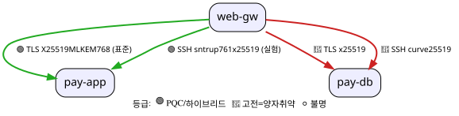

한국어 · [English](README.en.md)

# pqcota

[](https://github.com/randyinthedev-hash/pqcota/actions/workflows/ci.yml)
[](LICENSE)
[](go.mod)

> **v0.6.7**: Discovery · Inventory · Provisioning 3단계가 리눅스에서 종단으로 동작하고, [데모](demo/README.md) 6단계가 생성물을 실제 노드에 적용·되돌림까지 확인한다. **Windows 노드도 같은 디스커버리 경로**로 관측한다(CNG·JCA). 다만 전환물 생성은 아직이다 → [로드맵](RELEASE_NOTES.md#로드맵-예정-릴리스-계획)

PQC 마이그레이션 관리 플랫폼 **pqcota**([OSS](https://opensource.org/osd), [Apache-2.0](LICENSE)). 레거시 암호 런타임(OpenSSL · Java JCE/JCA)의 PQC 이관을 **Discovery → Inventory → Provisioning** 3단계로 다룬다.

**이름.** *pqcota*(발음 **P-cota**)는 **PQC**(양자내성암호)와 **Orchestra**(-ota)를 합친 말이다. **이 소프트웨어는 교향악의 *단원*이지 마에스트로가 아니다.** 무엇을·언제 이관할지 지휘하는 **마에스트로는 이 도구를 쓰는 사용자**이고, pqcota는 제 파트(관측·정규화·생성)를 정확히 연주한다.

[플랫폼 구조도](https://randyinthedev-hash.github.io/pqcota/architectures/platform-structure.html)

[시연영상 (2분 55초)](https://www.youtube.com/watch?v=2KMcxjZ_7kQ): 관측부터 전환물 적용·되돌림까지, 실제 노드에서 ML-KEM이 **0개 → 14개 → 0개**로 바뀐다.

**더 볼 곳** → [설계 문서](docs/README.md) · [이 리포를 어떻게 관리하나](docs/governance.md) · [로드맵](RELEASE_NOTES.md#로드맵-예정-릴리스-계획) · [기여](CONTRIBUTING.md)

---

## 무엇이 나오나

관측한 것을 노드·앱에 이어 붙이고, 회선에서 **실제로 협상된 그룹**까지 함께 본다.

```
──────── ① discovered assets (per node) ────────
  pay-app
    • JCA provider chain: SUN,SunRsaSign,…,BC   [EVIDENCE_STRENGTH_CONFIRMED]
        ↑ 이 BC는 java.security에 한 줄도 없다 (grep 0건).
          앱이 실행 중에 등록한 것이라 정적 스캔으로는 안 보인다.
    • OpenSSL  libcrypto.so.3 3.5.5 (OpenSSL)   [EVIDENCE_STRENGTH_CONFIRMED]
  pay-db
    • OpenSSL  libcrypto.so.1.1 1.1.1f (OpenSSL) [EVIDENCE_STRENGTH_CONFIRMED]

──────── ② observed edges + quantum-resistance grade ────────
  🟢 web-gw  → pay-app   TLS  X25519MLKEM768 [fips-standard]
  🟢 web-gw  → pay-app   SSH  sntrup761x25519-sha512@openssh.com [experimental]
  🔴 web-gw  → pay-db    TLS  x25519
  🔴 web-gw  → pay-db    SSH  curve25519-sha256

  grade totals: 🟢 PQC 2 · 🔴 classical 2 · ⚪ unknown 0
```

같은 관측을 토폴로지로도 낸다.



**🔴는 "취약하다"는 판정이 아니라 "고전 알고리즘으로 협상됐다"는 관측이다.** 무엇을 언제 바꿀지는 사용자가 정한다. 전체 예상 출력은 [demo/expected-output](demo/expected-output/README.md)에 있다.

## 무엇을 하나: 세 단계

| 단계 | 하는 일 | 산출 |
|---|---|---|
| ① **[Discovery](discovery/README.md)** | 실행 중인 시스템이 **어떤 암호 알고리즘을 쓰는지 관측**한다(로드된 라이브러리, JVM provider 체인, 핸드셰이크에서 협상된 알고리즘) | 노드별 관측 결과(정규화된 CBOM) |
| ② **[Inventory](inventory/README.md)** | 관측을 **어느 노드·어느 앱의 것인지 이어 붙여 쌓는다**(머신 메타데이터, 스냅샷 간 변화 diff) | 중앙 인벤토리(append-only) |
| ③ **[Provisioning](provisioning/README.md)** | 확정된 계획에서 **PQC 전환 산출물을 만든다**(config 조각, 적용·롤백 Ansible 플레이북(L1/L2/L3), 롤백 근거) | 플레이북 + before 레코드 |

**하지 않는 것.** 선언(CMDB) 대조·리뷰 확정 거버넌스·플릿 오케스트레이션은 **이 리포에 없다.**
계약([`contracts/`](contracts/README.md))에 들어올 곳만 정해 두었고, 판정 엔진은 만들지 않는다.
도구가 대신 판단하면 "🔴는 판정이 아니라 관측"이라는 선이 무너지기 때문이다. 무엇을 만들고 무엇을
만들지 않았는지는 [아키텍처의 명시적 제외·경계](docs/architecture.md#62-명시적-제외--경계)가 결정한다.

## 써보기: 데모

**Docker만 있으면** 전 범위를 한 번에 돌려본다. 순서는 접근준비 → 디스커버리 → 인벤토리 →
프로비저닝(생성·적용·되돌림)이고, 컨테이너로 세운 노드들을 실제로 관측한다.

```bash
./demo/scripts/up.sh && ./demo/scripts/demo.sh   # 정리: ./demo/scripts/down.sh
```

구성·예상 결과·자기 호스트에 적용하는 법 → **[demo/](demo/README.md)**

컨테이너 없이 **실제 인프라에서 어떤 순서로 무엇이 나오는지** 한 번에 따라가려면 → **[여정](docs/journey.md)**

---

## 사전 요구

**빌드**
- Go 1.26.4+
- buf (+`protoc-gen-go`·`protoc-gen-go-grpc`)
- JDK 11+: **선택**이다. JVM attach 사이드카를 만들 때만 쓰고, 없으면 그 단계만 건너뛴다

**실행**
- 여러 노드 관측: 컨트롤러에 Ansible이 있어야 하고 대상 노드로 SSH가 닿아야 한다
- 단일 노드 관측: 설치할 것이 없다. 그 노드에서 바이너리를 직접 실행한다(`pqcota-netcap`은 `CAP_NET_RAW`가 필요하다) → [discovery/cmd](discovery/cmd/README.md)

## 빌드

pqcota는 **중앙 컨트롤러 노드** 하나와, 그 컨트롤러가 Ansible/SSH로 닿는 **대상 노드들**로 구성된다.
**빌드는 컨트롤러에서 한다.** 컨트롤러에서 실행할 CLI와 대상 노드로 보낼 collector를 여기서 함께 만든다.

**클론한 그대로 빌드된다.** 계약에서 만든 `gen/`이 커밋돼 있어 코드 생성 도구를 따로 갖출 필요가 없다.
소비자가 `go get`만으로 계약 타입을 쓰게 하려고 그렇게 두었다. proto를 고칠 때만 다시 만드는데,
그 절차는 이 절 끝에 있다.

**① 컨트롤러에서 쓸 CLI.** 관측 결과를 적재·조회하고 플레이북을 생성하는 커맨드들이다.

```bash
go build -o bin/ ./discovery/cmd/... ./inventory/cmd/... ./provisioning/cmd/...
```

**② 대상 노드에 올릴 collector.** **노드 OS·arch에 맞춰** 정적으로 만든다
→ [배포 설계](discovery/collector-deployment.md). 어느 collector가 어느 OS에서 도는지는
[커맨드 레퍼런스](discovery/cmd/README.md)에 있다.

```bash
# 리눅스 노드
CGO_ENABLED=0 GOOS=linux GOARCH=amd64 go build -o dist/linux-amd64/ \
  ./discovery/cmd/pqcota-nodescan ./discovery/cmd/pqcota-netcap ./discovery/cmd/pqcota-jvmscan

# Windows 노드
CGO_ENABLED=0 GOOS=windows GOARCH=amd64 go build -o dist/windows-amd64/ ./discovery/cmd/pqcota-cngscan

make build-jar                  # JVM 노드가 있을 때만: attach 사이드카 → build/collector.jar
```

`CGO_ENABLED=0`(정적 링크라 배포판·libc를 가리지 않는다)은 고정이고, 바꾸는 것은 `GOOS`·`GOARCH`뿐이다.
값 목록은 [Go 문서](https://go.dev/doc/install/source#environment)를 따른다.

**리눅스 노드의 커널은 3.2 이상**이면 된다. 이는 Go 툴체인이 정하는 하한이고, 이 리포가 그보다 새 기능을 요구하지 않는다. CentOS 7(3.10)·Debian 8(3.16)이 위에 있고, RHEL 6(2.6.32)이 아래다. 기능별로 더 필요한 것은 [지원 범위](discovery/cmd/README.md#실행-요건-커널권한)에 있다.

노드에서 collector를 돌릴 때의 권한·환경변수 → [discovery/cmd](discovery/cmd/README.md#권한--환경변수).

**proto를 고쳤다면 계약 코드를 다시 만든다.** 여기부터는 리포에 손대는 사람의 절차다. `make tools`가
생성 플러그인(`protoc-gen-go`·`-grpc`)을 설치하고 `make generate`가 변환한다. 만들어진 `gen/`은 고친
proto와 **같은 커밋에** 넣는다.

```bash
make tools && make generate     # contracts/*.proto → gen/
```

> `make tools`는 플러그인을 `$(go env GOPATH)/bin`에 넣는데, 그 디렉터리가 `PATH`에 없으면 `make
> generate`가 "플러그인 없음"으로 넘어진다. 설치가 실패한 것처럼 보이지만 실은 **안 보이는 것뿐**이다.
> 두 타깃 모두 그 상황을 짚어 주지만, 셸 설정에 미리 넣어 두면 매번 겪지 않는다:
> `export PATH="$PATH:$(go env GOPATH)/bin"`.

리포에 기여한다면(테스트·게이트·계약 변경) → [CONTRIBUTING](CONTRIBUTING.md).

## 스택

- **Go**: collector·CLI 전부다. `CGO_ENABLED=0` 정적 단일 바이너리로 만든다
- **Java**: JVM attach 사이드카에만 쓴다. JVM 안에서만 가능한 관측이기 때문이다
- **Protobuf/gRPC**: 단계 사이를 잇는 계약이다([`contracts/`](contracts/))
- **Postgres**: 여러 노드를 시간에 걸쳐 쌓고 조회할 때만 쓴다. 단일 노드 관측에서는 쓰지 않는다

## 무엇을 지원하나: 단계별

### 관측 (Discovery)

| 무엇을 관측 | 대상 | 왜 |
|---|---|---|
| OpenSSL 자산 · 통신 엣지 | **Linux** (amd64·arm64) | `/proc`·ELF·AF_PACKET에 의존한다 |
| JVM provider 체인 | **Java 8+** · Linux(전체) · Windows(JDK 있을 때) | **JDK 없이 붙는 경로가 리눅스 전용**이다. Windows는 머신에 JDK가 있어야 런타임 등록까지 보고, 없으면 `java.security`만 읽는다 |
| Windows CNG provider·알고리즘 | **Windows** (amd64·arm64) | `bcrypt.dll`에 등록된 provider를 직접 묻는다. WMI·PowerShell을 부르지 않는다 |

### 인벤토리 (Inventory)

| 무엇을 | 대상 | 왜 |
|---|---|---|
| 적재·조회 CLI | **어디서든**(Linux · macOS · Windows) | 파일과 DB만 만진다. OS 프리미티브를 안 쓴다 |
| 저장소 | **Postgres** (append-only) | 이력·변화를 볼 때만 쓴다. 한 번 훑는 정도면 `pqcota-discover-view`가 저장소 없이 낸다 |
| 받는 입력 | collector의 `CollectionResult` · **CycloneDX 1.6/1.7** CBOM · 사람이 적은 선언 | **기계가 본 것과 사람이 적은 것을 한 자리에 섞지 않는다** |

### 전환 (Provisioning)

확정 계획의 조치 종류에 따라 갈린다.

| 런타임 | 상황 | 생성물 |
|---|---|---|
| **OpenSSL** | 3.5+ (네이티브 PQC) | config 조각만 만든다. 레거시는 건드리지 않는다 |
| | 3.0–3.4 | provider 모듈 배치 + 그 모듈을 참조하는 config 조각. 모듈 자체는 사용자가 준비한다 |
| | 1.1.1 이하 | **생성하지 않는다.** 포크 교체가 필요하므로 수동 단계로 표기한다 |
| **JCA**(Java) | **JDK 24+** (네이티브 PQC) | `java.security` 조각만 만든다. 고전 그룹을 함께 두는데, 릴리스 JDK가 아직 하이브리드 그룹을 협상하지 않기 때문이다(JDK 25까지 재 봤다) |
| | **JDK 8+** (provider 주입) | provider JAR 배치 + `java.security` 등록 조각. JAR 배치만으로는 로드되지 않아 활성화가 따로 필요하다 |
| | 그 이하(EOL) | **생성하지 않는다.** JDK 업그레이드가 필요하므로 수동 단계로 표기한다 |

적용은 Ansible 플레이북으로 한다. 생성되는 플레이북이 POSIX 경로·모듈(`ansible.builtin.copy`, `/opt/pqcota`)을 전제하므로 대상 노드는 **Linux**다. Ansible 자체는 Windows도 다루지만 이 산출물이 아직 그렇지 않다.

Windows(CNG)는 **관측된다**(`pqcota-cngscan`). 전환물 생성은 substrate 일반화가 선행이라 [로드맵](RELEASE_NOTES.md)에 있다.

---

## 상태 · 버전

**릴리스마다** arch별 정적 바이너리와 `SHA256SUMS`가 [릴리스](https://github.com/randyinthedev-hash/pqcota/releases)에 붙는다.
받은 뒤 `sha256sum -c SHA256SUMS`로 확인한다. 서명된 릴리스는 [로드맵](RELEASE_NOTES.md)에 있다.
버전별 목표·성과는 [릴리스 노트](RELEASE_NOTES.md)에 있다.

## 라이선스

- **Apache-2.0**: 원문은 [LICENSE](LICENSE)에 있다
- 의존성 라이선스 정리 → [라이선스 정리](docs/licensing.md)
- 서드파티 고지 → [THIRD-PARTY-NOTICES](THIRD-PARTY-NOTICES.md)
