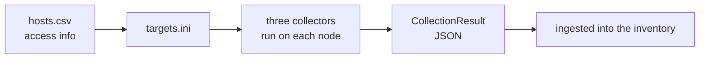

English · [한국어](README.md)

# Discovery — observation (stage 1)

> 🌐 Translated from the Korean original. If the two differ, the [Korean version](README.md) is authoritative.

Observes **which cryptographic algorithms a running system actually uses** — not the cryptography itself (no ciphertext, no keys), but **which libraries, providers, and algorithms are loaded, registered, and negotiated**. It captures the **runtime reality** that static document and source scans cannot see (providers registered at runtime, libraries actually loaded, groups actually negotiated on the wire), and attaches a quantum posture to each asset (🟢 PQC/hybrid · 🔴 classical = quantum-vulnerable · ⚪ unknown).

> **§ notation**: unless stated otherwise, these are section numbers in the [process regulation](../docs/regulation.en.md).

**Why runtime** — configuration (`openssl.cnf`, `java.security`, nginx `ssl_ciphers`) is an *allow list*, so it diverges from reality. A PQC group written there falls back to classical if the peer does not support it, and an app may register a provider at runtime that never appears in `java.security`. So the evidence comes from **libraries loaded in the running process** and **algorithms negotiated in the handshake**. When the runtime cannot be reached, it falls back to configuration — but then `evidence_strength` is lowered and the gap is recorded.

## At a glance



## What it consists of

| Piece | What it is |
|---|---|
| **Access prep** — `pqcota-hosts` | builds an Ansible inventory from the `hosts.csv` you wrote |
| **The three collectors** | listed below. They run on the observed machine and emit a `CollectionResult` |
| **Reference playbook** — [`ansible/`](ansible) | ships, runs, retrieves, and cleans up collectors across prepared nodes |

| Collector | What it observes | How |
|---|---|---|
| **[openssl](collectors/openssl/README.md) (Korean)** | loaded libcrypto/libssl, fork, app attribution | parses `/proc` and ELF **itself** (Linux) — no dependency on `ldd` or `readelf` |
| **[jvm](collectors/jvm/README.md) (Korean)** ★ | the **actual** live JCA provider chain (registration order included) | JVM attach → `getProviders()` (pure-Java sidecar) |
| **[network](collectors/network/README.md) (Korean)** | TLS/SSH handshake groups → communication edges | passive AF_PACKET capture (Linux), no decryption |

★ The **killer capability** of this stage is that jvm attach catches **dynamically registered providers** (BouncyCastle added via `addProvider` at runtime, for instance) that static scanning cannot see — a gap no dedicated OSS filled.

## Try it quickly

**A single node, right where it is** — nothing to install, no Ansible needed.

```bash
pqcota-nodescan --output table            # a table on screen (nothing is stored)
pqcota-nodescan node-01 > result.json     # JSON (when accumulating centrally)
```

**Several nodes** — write down the access info and run them all through the reference playbook.

```bash
pqcota-hosts --ansible-out targets.ini hosts.csv
ansible-playbook -i targets.ini discovery/ansible/discover.yml
pqcota-ingest ./results                   # ingest the retrieved results into the inventory
```

Arguments, privileges, and environment variables per command → [discovery/cmd](cmd/README.en.md).

## When it doesn't work — symptom and cause

| Symptom | Cause |
|---|---|
| `could not open /proc, so nothing was observed` | not Linux. The result goes out as a **gap, not as empty** |
| only the scanning process's own assets show up | not root — another user's `/proc` is unreadable (whatever was not observed is reported as a gap) |
| `no CAP_NET_RAW — could not observe` | `setcap cap_net_raw+ep`, or root. The exit code is 0 on purpose — so the gap reaches the center |
| JVM providers show **only the static chain** | attach was blocked and it fell back (`DisableAttachMechanism`, JEP 451, permissions). Runtime-registered providers are a blind spot there, and that is reported as a gap |
| zero observed edges | no handshake flowed during the observation window. Idle links are invisible in production too — this is **not absence, it is not-observed** |

## If you need more

How each collector parses, how far it degrades, and what the six normalization steps, completeness map, and scope gate are → **[Discovery design](design.en.md)**.

## This folder

- [`collectors/`](collectors) — collector implementations (openssl · jvm · network)
- [`cmd/`](cmd) — entry points for access prep and collector execution → [command map](cmd/README.en.md)
- [`ansible/`](ansible) — the **reference playbook** that runs collectors across prepared nodes at once
- **Design docs**: [Discovery design](design.en.md) · [collector deployment](collector-deployment.md) · [test cases](testcases.md) (Korean)

## See also

Regulation §2 · [architecture](../docs/architecture.en.md) · normalization and history libraries [`pkg/discovery/`](../pkg/discovery) · runnable examples [`examples/discovery/`](../examples/discovery)
