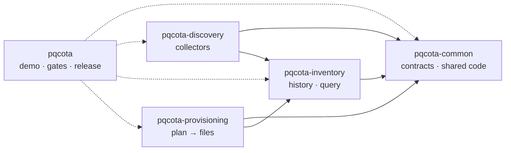
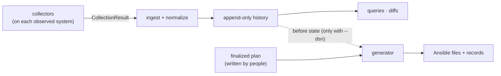

[English](developers.md) · 한국어

# 개발자 문서

pqcota를 빌드하고 확장하고 검토하는 엔지니어를 위한 문서입니다. 전체 문서의 목차이며, 리포지터리 다섯 개가 어떻게 맞물리는지와 다음에 읽을 문서를 알려 줍니다. pqcota가 무엇인지, 결과를 어떻게 쓰는지 알고 싶다면 [README](../README.ko.md), [자주 묻는 질문](faq.ko.md), [보고 안내](reporting-guide.ko.md)를 읽으세요.

## 여기서 시작하세요

1. **[빌드 안내](build.ko.md)**가 첫 작업입니다. 새로 클론한 상태에서 동작하는 빌드와 통과하는 점검 실행까지 안내합니다.
2. **무엇이든 실행해 보세요.** [데모](../demo/README.ko.md)는 컨테이너에서 전체 흐름을 실행합니다(Docker가 필요합니다). [예제](../examples/README.ko.md)는 Go만으로 명령을 하나씩 실행합니다.
3. 아래 [단계별 안내](#단계별-안내)에서 **관심 있는 단계를 고르세요.**

## 리포지터리 다섯 개가 맞물리는 방식

pqcota는 함께 빌드하고 테스트하고 릴리스하는 리포지터리 다섯 개입니다. 릴리스마다 다섯 리포지터리에 같은 태그가 붙습니다.

화살표는 모듈이 가져다 쓰는(import) 모듈을 가리킵니다. 실선 화살표는 네 모듈 사이의 규칙이며, `make check-deps`가 다른 방향의 import를 거부해 이 규칙을 지킵니다(허용된 선을 모두 써야 하는 것은 아닙니다).

- `pqcota-common`은 다른 pqcota 모듈을 import하지 않습니다.
- `pqcota-inventory`는 pqcota 모듈 중 common만 import합니다.
- `pqcota-discovery`와 `pqcota-provisioning`은 common과 inventory를 import하며, **서로는 import하지 않습니다**.
- discovery 안에서 수집기는 common과 `pkg/discovery/procs`만 import합니다. 수집기는 관측 대상 시스템에 올라가는 바이너리에 들어가므로 다른 단계의 코드를 함께 싣지 않아야 하기 때문입니다.

통합 리포지터리 `pqcota`는 네 모듈을 모두 import합니다. 대부분 테스트와 도구에서 쓰며, 예를 들어 단계 간 테스트가 common 패키지를 import합니다. 이 리포지터리에는 데모, 다섯 리포지터리를 모두 재는 게이트 도구, 단계에 걸친 테스트, 릴리스 워크플로가 있습니다.

| 리포지터리 | 들어 있는 것 |
|---|---|
| [`pqcota`](https://github.com/randyinthedev-hash/pqcota) | `demo/`, `examples/`(안내판), `tools/`(게이트), `test/crossstage/`, 릴리스 워크플로, 이 문서들 |
| [`pqcota-common`](https://github.com/randyinthedev-hash/pqcota-common) | protobuf 계약과 커밋된 생성 Go 코드(`gen/`), `pkg/kernel`(레지스트리, 상태, 범위, 머신 식별자, 서명, 완전성), `pkg/org`, `cmd/pqcota-keygen` |
| [`pqcota-inventory`](https://github.com/randyinthedev-hash/pqcota-inventory) | `pkg/inventory`(이력, 정규화, 적재, 결과 읽기, 선언)와 인벤토리 명령 |
| [`pqcota-discovery`](https://github.com/randyinthedev-hash/pqcota-discovery) | `collectors/`(OpenSSL, JVM, 네트워크, CNG), 관측 명령, 참조용 Ansible 플레이북, `pkg/discovery/procs` |
| [`pqcota-provisioning`](https://github.com/randyinthedev-hash/pqcota-provisioning) | `pkg/provisioning`(계획 점검, 산출물 생성, 기록)과 전환물 생성 명령 |

## 데이터가 이동하는 방식

관측과 저장 사이에서 오가는 것은 **계약에 정의된 메시지**이며, 그 계약이 두 단계의 이음매입니다. 단계끼리 코드 수준에서 완전히 분리된 것은 아닙니다. 관측 명령은 인벤토리 패키지를 쓰고, 전환물 생성은 인벤토리 이력을 직접 조회할 수 있습니다.

- 수집기는 `CollectionResult`를 냅니다. 이것은 CycloneDX 자산 본문, 출처 정보(봉투, envelope), 수집기 고유의 원본 결과, 관측한 것과 관측하지 못한 것을 적은 완전성 기록, 관측한 연결 간선으로 이루어집니다. 연결 간선은 CycloneDX 본문 밖으로 전달됩니다. 자산의 pqcota 고유 세부 정보는 CycloneDX `properties`에 담습니다. 수집기는 찾은 것을 해석하지 않습니다. 증거 강도와 양자내성 등급은 나중에 코어가 도출하므로 다시 계산할 수 있습니다.
- 인벤토리는 결과를 적재하고 정규화해서 이력에 추가합니다.
- 전환물 생성은 사람이 쓰고 승인한 계획을 읽어 파일을 생성합니다. 데이터베이스(`--dsn`)를 받으면 인벤토리 이력도 조회해 변경 전 상태를 기록합니다. 계획을 만들지 않고, 아무것도 적용하지 않습니다.

관측 대상이 현재의 어휘에 들어맞는다면, 추가 수집기는 코어를 바꾸지 않고 기존 `CollectionResult` 이음매를 쓸 수 있습니다. 새로운 암호 런타임은 계약과 정규화도 바꿔야 할 수 있습니다. [CONTRIBUTING](../CONTRIBUTING.ko.md)의 "Extending with a new crypto runtime"을 보세요. 계약 변경은 그 메시지를 읽는 모든 단계와 `gen/`의 생성 코드에 영향을 주므로 가장 신중하게 다뤄야 합니다.

## 단계별 안내

단계 리포지터리는 모두 같은 구성입니다. 개요 README, 명령 참조, 실행 가능한 예제입니다.

| 단계 | 개요 | 명령 | 예제 |
|---|---|---|---|
| **Common**(계약, 공유 코드) | [README](https://github.com/randyinthedev-hash/pqcota-common/blob/main/README.md)(영문) | [cmd](https://github.com/randyinthedev-hash/pqcota-common/blob/main/cmd/README.md)(영문) | 없음 |
| **관측(Discovery)** | [README](https://github.com/randyinthedev-hash/pqcota-discovery/blob/main/README.md)(영문) | [cmd](https://github.com/randyinthedev-hash/pqcota-discovery/blob/main/cmd/README.md)(영문) · [참조 플레이북](https://github.com/randyinthedev-hash/pqcota-discovery/blob/main/ansible/README.md)(영문) | [예제](https://github.com/randyinthedev-hash/pqcota-discovery/blob/main/examples/discovery/README.md)(영문) |
| **인벤토리** | [README](https://github.com/randyinthedev-hash/pqcota-inventory/blob/main/README.md)(영문) | [cmd](https://github.com/randyinthedev-hash/pqcota-inventory/blob/main/cmd/README.md)(영문) | [예제](https://github.com/randyinthedev-hash/pqcota-inventory/blob/main/examples/inventory/README.md)(영문) |
| **전환물 생성(Provisioning)** | [README](https://github.com/randyinthedev-hash/pqcota-provisioning/blob/main/README.md)(영문) | [cmd](https://github.com/randyinthedev-hash/pqcota-provisioning/blob/main/cmd/README.md)(영문) | [예제](https://github.com/randyinthedev-hash/pqcota-provisioning/blob/main/examples/provisioning/README.md)(영문) · [샘플 계획](https://github.com/randyinthedev-hash/pqcota-provisioning/blob/main/examples/provisioning/plans/README.md)(영문) |

새 기여자에게 권하는 순서는 이렇습니다. 단계 README(무엇을 하고 어디서 멈추는지), 그 단계의 예제(무엇이든 실행), 명령 참조(세부 사항) 순입니다.

프로그램이 읽는 모든 환경변수는 [환경변수 참조](environment-variables.ko.md)에 있습니다.

## 계약 변경

계약은 `pqcota-common`에 있으며 다른 어느 것보다 먼저 바뀝니다. 다음 순서로 읽으세요.

1. [계약 개요](https://github.com/randyinthedev-hash/pqcota-common/blob/main/contracts/README.md)(영문): 설계 결정, 버전 규칙, 계약이 바뀔 때 함께 움직여야 하는 것의 점검 목록입니다.
2. [데이터 모델](https://github.com/randyinthedev-hash/pqcota-common/blob/main/contracts/data-model.md)(영문): 모든 메시지, 필드, 열거형입니다.
3. [호환성 정책](compatibility.ko.md): 절대 깨지 않는 것(와이어 형식, 서명, Go API, 데이터베이스 스키마)과 모듈 경로 변경을 다루는 방법입니다.
4. [계약 변경하기](change-a-contract.ko.md): 작업 순서, 계약과 함께 움직여야 하는 것, 로컬 점검과 CI가 다른 점입니다. 재생성 명령은 [빌드 안내](build.ko.md#계약-변경)에 있습니다.

## 점검과 기여

- **작업 점검:** [빌드 안내](build.ko.md#작업-확인)에서 점검을 실행하는 방법을 설명하고, [점검과 게이트](checks-and-gates.ko.md)에서 각 점검이 무엇을 지키는지, 어디서 실행되는지, 통과해도 무엇을 보여 주지 못하는지 설명합니다.
- **[CONTRIBUTING](../CONTRIBUTING.ko.md):** 개발 순환, 코딩 지침, 테스트, 변경을 제안하는 방법입니다.
- **리포지터리 공통 관례:** 문서는 영문이고, 코드 주석은 한국어이며, 코드가 내보내는 모든 것(출력, 오류, 계약에 실리는 문자열)은 영문입니다. `gen/`의 생성 코드는 커밋되며 계약에서 다시 생성해야만 바뀝니다.
- **[보안 정책](../SECURITY.ko.md)**과 **[행동 강령](../CODE_OF_CONDUCT.ko.md)**.
- **[릴리스 노트](../RELEASE_NOTES.md)(영문)**와 **[라이선스 안내](licensing.ko.md)**, 그리고 [제3자 고지](../THIRD-PARTY-NOTICES.md)(영문).

## 사용자용 문서

[README](../README.ko.md)(pqcota가 무엇인지), [첫 이관 안내](pqc-migration-primer.ko.md), [자주 묻는 질문](faq.ko.md), [보고 안내](reporting-guide.ko.md)는 개발자가 아니라 이관을 실행하거나 따라가는 사람을 위해 쓴 문서입니다.
