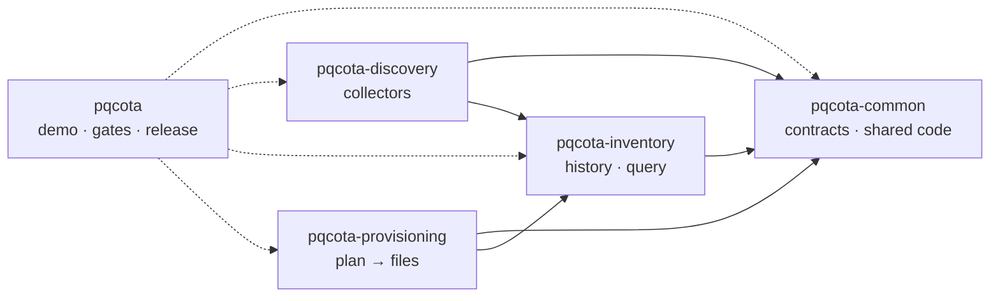
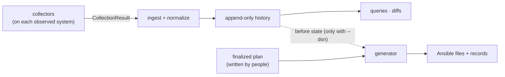

English · [한국어](developers.ko.md)

# Developer documentation

For engineers who build, extend or review pqcota. It is the table of contents: it says how the five repositories fit together and which document to read next. If you want to know what pqcota is, or how to use its results, read the [README](../README.md), the [FAQ](faq.md) and the [reporting guide](reporting-guide.md) instead.

## Start here

1. **[Build guide](build.md)** is the first task. It takes you from a fresh clone to a working build and a passing check run.
2. **Run something.** The [demo](../demo/README.md) runs the whole flow on containers (needs Docker). The [examples](../examples/README.md) run one command at a time with only Go.
3. **Pick the stage you care about** from [Stage by stage](#stage-by-stage) below.

## How the five repositories fit

pqcota is five repositories that are built, tested and released together. Each release is the same tag on all five.

An arrow points from a module to a module it imports. The solid arrows are the rule among the four modules, and `make check-deps` enforces it by refusing imports in any other direction (it does not require every allowed line to be used):

- `pqcota-common` imports no other pqcota module.
- `pqcota-inventory` imports only common among the pqcota modules.
- `pqcota-discovery` and `pqcota-provisioning` import common and inventory, and **never each other**.
- Inside discovery, the collectors import only common and `pkg/discovery/procs`, because they are built into the binaries that go onto the observed systems and must not carry other stages' code with them.

`pqcota` (the integration repository) imports all four, mostly from its tests and tools; for example, its cross-stage tests import common packages. It holds the demo, the gate tools that measure all five repositories, the tests that span stages, and the release workflow.

| Repository | What is in it |
|---|---|
| [`pqcota`](https://github.com/randyinthedev-hash/pqcota) | `demo/`, `examples/` (a signpost), `tools/` (the gates), `test/crossstage/`, the release workflow, these documents |
| [`pqcota-common`](https://github.com/randyinthedev-hash/pqcota-common) | The protobuf contracts and their committed generated Go code (`gen/`), `pkg/kernel` (registry, posture, scope, machine identity, signing, completeness), `pkg/org`, `cmd/pqcota-keygen` |
| [`pqcota-inventory`](https://github.com/randyinthedev-hash/pqcota-inventory) | `pkg/inventory` (history, normalization, ingest, result reading, declarations) and the inventory commands |
| [`pqcota-discovery`](https://github.com/randyinthedev-hash/pqcota-discovery) | `collectors/` (OpenSSL, JVM, network, CNG), the discovery commands, the reference Ansible playbook, `pkg/discovery/procs` |
| [`pqcota-provisioning`](https://github.com/randyinthedev-hash/pqcota-provisioning) | `pkg/provisioning` (plan checks, artifact generation, records) and the provisioning commands |

## How data moves

What passes between observation and storage is a **message defined in the contracts**, and that contract is the seam. The stages are not fully isolated from each other at the code level: discovery's commands use inventory packages, and provisioning can query the inventory history directly.

- A collector emits a `CollectionResult`: a CycloneDX asset body, provenance (the envelope), the collector's own raw result, a completeness record of what it could and could not see, and any observed connection edges. Connection edges travel outside the CycloneDX body. pqcota-specific details of an asset use CycloneDX `properties`. Collectors do not interpret what they find: evidence strength and quantum-resistance grades are derived later by the core, so they can be recomputed.
- Inventory ingests results, normalizes them and appends them to the history.
- Provisioning reads a plan that people wrote and approved, and generates files. When it is given a database (`--dsn`), it also queries the inventory history to capture the state before. It does not create plans and does not apply anything.

An additional collector can use the existing `CollectionResult` seam without changing the core when what it observes fits the current vocabulary. A new crypto runtime may need contract and normalization changes as well; see "Extending with a new crypto runtime" in [CONTRIBUTING](../CONTRIBUTING.md). A contract change touches every stage that reads the message and the generated code in `gen/`, which is why it deserves the most care.

## Stage by stage

Each stage repository follows the same pattern: an overview README, a command reference, and runnable examples.

| Stage | Overview | Commands | Examples |
|---|---|---|---|
| **Common** (contracts, shared code) | [README](https://github.com/randyinthedev-hash/pqcota-common/blob/main/README.md) | [cmd](https://github.com/randyinthedev-hash/pqcota-common/blob/main/cmd/README.md) | none |
| **Discovery** | [README](https://github.com/randyinthedev-hash/pqcota-discovery/blob/main/README.md) | [cmd](https://github.com/randyinthedev-hash/pqcota-discovery/blob/main/cmd/README.md) · [reference playbook](https://github.com/randyinthedev-hash/pqcota-discovery/blob/main/ansible/README.md) | [examples](https://github.com/randyinthedev-hash/pqcota-discovery/blob/main/examples/discovery/README.md) |
| **Inventory** | [README](https://github.com/randyinthedev-hash/pqcota-inventory/blob/main/README.md) | [cmd](https://github.com/randyinthedev-hash/pqcota-inventory/blob/main/cmd/README.md) | [examples](https://github.com/randyinthedev-hash/pqcota-inventory/blob/main/examples/inventory/README.md) |
| **Provisioning** | [README](https://github.com/randyinthedev-hash/pqcota-provisioning/blob/main/README.md) | [cmd](https://github.com/randyinthedev-hash/pqcota-provisioning/blob/main/cmd/README.md) | [examples](https://github.com/randyinthedev-hash/pqcota-provisioning/blob/main/examples/provisioning/README.md) · [sample plans](https://github.com/randyinthedev-hash/pqcota-provisioning/blob/main/examples/provisioning/plans/README.md) |

Suggested order for a new contributor: the stage README (what it does and where it stops), then its examples (run something), then its command reference (the details).

Every environment variable the programs read is listed in the [environment variable reference](environment-variables.md).

## Changing a contract

Contracts live in `pqcota-common` and change before anything else does. Read them in this order:

1. [Contracts overview](https://github.com/randyinthedev-hash/pqcota-common/blob/main/contracts/README.md): the design decisions, the versioning rules and the checklist of what else moves when a contract changes.
2. [Data model](https://github.com/randyinthedev-hash/pqcota-common/blob/main/contracts/data-model.md): every message, field and enum.
3. [Compatibility policy](compatibility.md): what is never broken (the wire format, signatures, the Go API, the database schema) and how a module path change is handled.
4. [Change a contract](change-a-contract.md): the order of work, what else has to move with a contract, and how the local checks differ from CI. The [build guide](build.md#change-a-contract) has the regeneration commands.

## Checking and contributing

- **Check your work:** the [build guide](build.md#check-your-work) explains how to run the checks, and [Checks and gates](checks-and-gates.md) says what each one guards, where it runs and what a pass does not show.
- **[CONTRIBUTING](../CONTRIBUTING.md):** the development loop, coding guidelines, testing, and how to propose a change.
- **Conventions across the repositories:** documents are English; code comments are Korean; whatever the code emits (output, errors, strings carried by the contract) is English. The generated code in `gen/` is committed, and is changed only by regenerating it from the contracts.
- **[Security policy](../SECURITY.md)** and **[Code of conduct](../CODE_OF_CONDUCT.md).**
- **[Release notes](../RELEASE_NOTES.md)** and **[license notes](licensing.md)**, with [third-party notices](../THIRD-PARTY-NOTICES.md).

## Documents for users

The [README](../README.md) (what pqcota is), the [first-migration guide](pqc-migration-primer.md), the [FAQ](faq.md) and the [reporting guide](reporting-guide.md) are written for people who run or follow a migration, not for developers.
