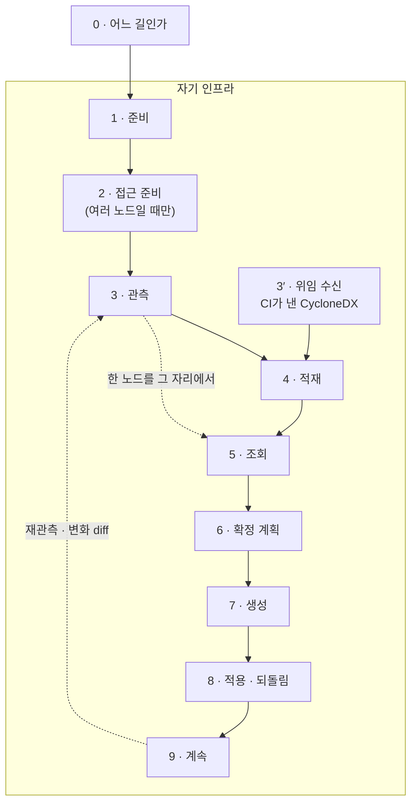

한국어

# 여정 — 관측에서 전환물까지

이 문서는 pqcota를 **한 번 처음부터 끝까지** 따라간다. 무엇을 어떤 규칙으로 하는지는
[규정서](regulation.md)와 단계별 설계가 정하고, 여기서는 **어떤 순서로 무엇이 나오는지**만 본다.

**밖으로 나가는 것은 없다.** 관측도 적재도 생성도 전부 자기 인프라 안에서 끝난다. 어디로
보내는 경로가 아예 없다 — 받을 곳이 없으니 보낼 것도 없다.

> **§ 표기**: 별도 언급이 없으면 [규정서](regulation.md)의 절 번호다.

---

## 한눈에



**점선 하나가 이 도구의 성질이다.** 한 노드만 볼 거면 2·4를 건너뛰고 화면에서 끝난다 — 중앙도
데이터베이스도 필요 없다.

---

## 0. 어느 길인가

| | 한 노드를 그 자리에서 | 여러 노드를 중앙에 쌓기 |
|---|---|---|
| 필요한 것 | 그 노드에서 바이너리 하나 | 컨트롤러 · SSH · Ansible · Postgres |
| 남는 것 | 화면 출력뿐 | append-only 히스토리 · 스냅샷 간 변화 |
| 무엇을 답하나 | "이 노드가 지금 무엇을 쓰나" | "무엇이 · 어디서 · 언제부터 바뀌었나" |
| 접근 준비(2) | 하지 않는다 | 필요하다 |

두 길은 배타적이지 않다. 같은 collector가 같은 `CollectionResult`를 내고, 그것을 화면으로 볼지
쌓을지가 갈릴 뿐이다.

### 처음 묻는 것

| 질문 | 답 |
|---|---|
| 무엇이 대상 노드에 남나 | **아무것도 남지 않는다.** collector를 반입·실행·회수하고 지운다. 상주 에이전트도 데몬도 없다 |
| 접속 계정·키는 어디에 | 인벤토리에는 **타입에 자리가 없다**(§1.5). 런타임 전용 Ansible 인벤토리(`0600`)에만 있고 영속되지 않는다 |
| 무엇을 읽나 | 로드된 라이브러리·등록된 provider·핸드셰이크에서 **협상된 알고리즘 이름**이다. 복호화하지 않고, 설정 원문·패킷 페이로드도 담지 않는다([raw_capture 규약](../contracts/README.md)) |
| 관측하지 못한 것은 | **못 봤다고 적는다.** 완전성 맵이 그 자리다(§2.6) — 조용히 빠지면 *"그 노드엔 없다"* 로 읽힌다 |
| 무엇을 판정하나 | **하지 않는다.** 🔴는 "취약하다"가 아니라 "고전 알고리즘으로 협상됐다"는 관측이다([아키텍처 §6](architecture.md#6-무판단-원칙)) |

---

## 1. 준비

| | |
|---|---|
| **Go 1.26.4+ · buf** | 두 가지를 만든다 — 컨트롤러에서 쓸 CLI, 노드에 올릴 collector |
| **JDK 11+** | **선택.** JVM attach 사이드카를 만들 때만. 없으면 그 단계만 건너뛴다 |
| **Ansible** | **선택.** 여러 노드에 collector를 반입·실행·회수할 때. 참조 플레이북이 리포에 있다 |
| **Postgres** | **선택.** 쌓아서 이력·변화를 볼 때만. 한 번 훑어보는 정도면 필요 없다 |

노드 쪽 요건은 **커널 3.2 이상**뿐이다 — Go 툴체인이 정하는 하한이고, 정적 링크라 배포판·libc를
가리지 않는다. collector는 리눅스 전용이다.

```bash
make tools && make generate                       # contracts/*.proto → gen/
go build -o bin/ ./discovery/cmd/... ./inventory/cmd/... ./provisioning/cmd/...
CGO_ENABLED=0 GOOS=linux GOARCH=amd64 go build -o dist/linux-amd64/ \
  ./discovery/cmd/pqcota-nodescan ./discovery/cmd/pqcota-netcap ./discovery/cmd/pqcota-jvmscan
```

---

## 2. 접근 준비 — 여러 노드를 훑을 때만

접속 정보는 **직접 쓴 CSV 한 벌**에서 시작한다. 거기서 두 가지가 갈려 나온다.

```bash
pqcota-hosts --ansible-out targets.ini --dsn "$PQCOTA_DSN" hosts.csv
```

| 나오는 것 | 무엇이 담기나 |
|---|---|
| `targets.ini` | 계정·키가 담기므로 **소유자만 읽게**(`0600`) 쓴다. 노드에 닿는 데만 쓴다 |
| 엔드포인트 upsert | `node_id`·이름·ip·port**만**. 계정·키는 빠진다 — 조회 화면의 `▸`머신 헤더가 여기서 나온다 |

**이 단계는 관측의 전제가 아니다.** 무엇이 필수이고 무엇이 선택인지는
[discovery/cmd — 필수인가](../discovery/cmd/README.md#필수인가--아니다-원격으로-여러-노드를-훑을-때만-필요하다)에 표로 있다.

---

## 3. 관측

| collector | 무엇을 보나 | 어떻게 |
|---|---|---|
| **nodescan** | 로드된 libcrypto/libssl · 버전 · fork · 어느 앱이 쓰나 | `/proc`·ELF **자체 파싱** — `ldd`·`readelf`를 부르지 않는다 |
| **jvmscan** | 살아 있는 JVM의 JCA provider 체인 | attach → `getProviders()`. 실행 중 등록된 provider까지 본다 |
| **netcap** | 핸드셰이크에서 협상된 키교환 그룹 | AF_PACKET(`CAP_NET_RAW`). 복호화하지 않는다 |

한 노드를 그 자리에서 보려면 화면으로 바로 받는다. 여러 노드면 참조 플레이북이 반입–실행–회수–정리를 한다.

```bash
pqcota-nodescan --output table                                  # 한 노드, 그 자리에서
ansible-playbook -i targets.ini discovery/ansible/discover.yml  # 여러 노드
```

산출은 `results/*.json`(`CollectionResult`)이고, **관측하지 못한 것이 함께 나온다.** `CAP_NET_RAW`가
없으면 종료코드 0으로 **갭 기록**을 낸다 — 실패로 끊으면 중앙에 그 노드 이야기가 아무것도 안 남아
"이 노드엔 TLS 링크가 없다"로 읽히기 때문이다.

엣지에는 그 통신을 연 앱이 붙는다. 짧게 붙었다 끊긴 연결은 조회 시점에 소켓이 이미 없어 `@?`로
남고, 그 자리는 [`pqcota-declare-attribution`](../inventory/cmd/README.md)으로 메운다 — 선언은
관측을 고치지 않고 자기 레인에 쌓인다.

---

## 3′. 위임 수신 — 직접 관측하지 않는 것은 받는다

**소스와 빌드 아티팩트는 스캔하지 않는다.** 소스가 있으면 CI가 이미 보고 있거나 봐야 할 일이라,
그 자리를 겹쳐 만들 이유가 없다. 대신 CI가 낸 **표준 CycloneDX를 받아** 검증·정규화해서
collector가 낸 것과 **같은 히스토리로 수렴**시킨다.

```bash
pqcota-cbom-ingest cbom.json cmdb://payment-gw     # 파일로
cbomkit scan ./repo | pqcota-cbom-ingest - cmdb://payment-gw   # CI에서 바로
```

| | |
|---|---|
| 거부하는 것 | **둘뿐이다** — 구조 부적합(CycloneDX가 아니거나 미지원 `specVersion`) · 서명 검증 실패. 기계적으로 판정되는 것만 막는다 |
| 거부가 아닌 것 | 앵커(`target_node_id`)가 없으면 **스코프 판정으로 라우팅**하고, `pqcota:` 프로퍼티가 없는 자산은 강도 미상으로 남긴다 — 못 믿을 것은 버리되 안 본 것을 없다고 하지 않는다 |
| 어느 레인인가 | **관측 레인**이다. `detection_method=source/artifact`가 붙어 런타임 관측과 구별되고, 증거 강도도 거기서 갈린다 |

**파일만 오간다.** 스캐너를 부르거나 링크하지 않으므로 그쪽 라이선스가 전염되지 않는다 →
[위임 수신 설계](../inventory/cbom-intake.md).

---

## 4. 적재

```bash
pqcota-ingest [-scope-assets <csv>] <results-dir> [scope-master-file]
```

`pqcota-ingest`가 한 디렉터리를 읽어 관문을 지나 append-only 히스토리에 넣는다. 관문은 **전부
선택이되, 켜면 여는 자리에서 막는다.**

| 관문 | 켜는 법 | 막는 것 |
|---|---|---|
| 노드 등재 | `[scope-master-file]` | 미등재 노드 — 버리지 않고 **등재요청**으로 남긴다 |
| 자산 스코프 | `-scope-assets` | 등재 노드 안에서 계속 볼 자산만. **뺀 건수를 고지한다**(§2.6) |
| 서명 | `PQCOTA_VERIFY_KEY` · `PQCOTA_REQUIRE_SIGNATURE` | 서명 불일치. "검증했다"와 "검증할 키가 없었다"를 한 숫자로 합치지 않는다 |
| 조직 | `PQCOTA_ORG` · `PQCOTA_REQUIRE_ORG` | 조직을 대지 않은 적재. 섞인 뒤에는 되돌릴 수 없다 |
| 스키마 자동 생성 | `PQCOTA_AUTO_DDL=0` | 가리키는 곳이 어긋났을 때 빈 테이블이 새로 생기고 거기 쓰는 것 |

받지 않은 것도 사실이라 **거절 이력**으로 남는다 — 원문은 담지 않고 지문만 남기므로, 같은 것이
반복해 오는지는 셀 수 있다.

**스냅샷은 변화 지점에만 쌓인다.** 같은 상태를 다시 관측하면 가벼운 관측 기록만 붙는다 — 저장은
변화 횟수만큼만 자라면서 "매번 스캔했다"는 증거는 남는다.

---

## 5. 조회

```bash
pqcota-inventory                       # 전 노드 최신 + 등급 집계
pqcota-inventory -history <node>       # 변화 지점을 오래된 것부터
pqcota-inventory -diff <old> <new>     # 두 스냅샷 사이의 변화
```

`▸`머신 헤더(엔드포인트·프로필) · 자산 줄의 `@`앱 표시 · 엣지의 양자내성 등급(🟢🔴⚪)이 한 화면에
붙는다. 파일만 있고 데이터베이스가 없으면 `pqcota-discover-view`가 같은 것을 취합해 보여준다.

오래된 변화 지점은 `pqcota-prune`으로 자른다. 자른 사실 자체가 절단 기록으로 남는다 — 이력의
구멍과 "원래 없었다"가 구별되어야 하기 때문이다.

---

## 6. 확정 계획 — 무엇을 바꿀지는 정하지 않는다

전환물 생성의 입력은 **확정 계획**(`FinalizedPlan` JSON)이다. `PLAN_STATUS_FINALIZED`가 아니면
생성기가 **거부한다** — 이 단계에서 가장 센 게이트다.

계획을 무엇으로 채울지, 무엇을 언제 바꿀지는 이 도구가 정하지 않는다. 손으로 쓴 계획으로도
끝까지 돌아간다 → [예시 계획들](../examples/provisioning/plans/README.md).

---

## 7. 생성

```bash
pqcota-provision --level l2 --dsn "$PQCOTA_DSN" plan.json > provision.yml
pqcota-provision --level l2 --rollback plan.json > rollback.yml
```

| 레벨 | 어디까지 |
|---|---|
| `l1` | 모듈을 타깃에 놓기까지 |
| `l2`(기본) | 모듈 배치 + config 조각 배치 |
| `l3` | 계획의 `activation` 훅(`pre`·`activate`·`deactivate`·`restart`)까지 |

**빈 훅은 지어내지 않는다.** 계획에 `activate`가 없으면 그 태스크를 만들지 않고 **무엇이 일어나지
않는지**를 stderr로 고지한다(예: 재시작 훅이 없으면 새 provider가 로드되지 않을 수 있다).

**provider 모듈 파일은 도구가 주지 않는다.** 어느 provider를 쓸지 고르고 그 파일을 구해 오는 일은
계획을 쓰는 쪽에서 하고, 도구는 그 파일이 **그대로 배치됐음**(`sha256`)까지 보장한다.

`--dsn`은 적용이 아니라 **기록**이다. 조치 *전* 상태(모듈@버전·config·provider 체인)를 캡처해
append-only 레코드로 남긴다 — 되돌릴 때 무엇으로 돌아가야 하는지의 근거가 여기 있다.

---

## 8. 적용 · 되돌림

생성물은 표준 Ansible 플레이북이라 자기 배포 도구로 돌리면 된다. 자체 원격 실행 엔진을 두지 않는다.

```bash
ansible-playbook -i targets.ini -e pqcota_module_sha256_oqsprovider=<sha256> provision.yml
ansible-playbook -i targets.ini rollback.yml    # 되돌림
```

**되돌림이 가능한 이유는 forward가 원본을 덮지 않기 때문이다** — 파일을 *추가*하므로 그 추가분
제거가 곧 복원이다. L3면 `deactivate` 훅으로 활성화까지 되돌린다. 역방향 플레이북은 **계획에서**
나온다 — 레코드를 읽지 않는다. 레코드는 무엇으로 돌아가야 하는지의 **근거**이지 되돌림의 입력이 아니다.

> **관측·조회는 몇 번을 돌려도 대상이 바뀌지 않지만, 적용은 쓴다.** 적용한 뒤 **재관측해 적재하고**
> `--dsn`으로 다시 생성하면, 그때 캡처되는 before는 히스토리의 최신 스냅샷 — 즉 **조치가 끝난
> 상태**다. 레코드는 append-only라 처음 캡처가 지워지지는 않지만 같은 `id`로 before가 둘이 되고,
> 순서대로 읽어 마지막 것을 집으면 틀린 before를 본다. 되돌릴 근거는 **처음 것**이다.

[데모](../demo/README.md)가 이 두 줄을 실제 노드에서 돌려 적용·되돌림까지 확인한다 — 생성만 보면
깨끗한 노드에서 깨지는 플레이북도 통과하기 때문이다.

---

## 9. 계속

| | |
|---|---|
| **재관측 → 변화 diff** | 같은 고리를 다시 돈다. 바뀐 것이 없으면 스냅샷이 늘지 않는다 |
| **조치 뒤 확인** | 인벤토리가 그대로면 그 이유까지 함께 낸다 — 관측 경로가 없는 층인지, 상대가 옛 스택인지 |
| **보존 절단** | 오래된 변화 지점을 자르고, 자른 사실을 기록으로 남긴다 |
| **제외분 고지** | 스코프로 뺀 자산은 조용히 사라지지 않고 건수가 화면에 남는다 |

---

## 지금 어디까지 됐나

| 여정 | 어디에 | 상태 |
|---|---|---|
| 3 · 관측 — openssl · jvm · network | [`discovery/`](../discovery/README.md) | **끝** — 리눅스 · 커널 3.2+ |
| 3′ · 위임 수신 — CI가 낸 CycloneDX | [위임 수신 설계](../inventory/cbom-intake.md) | **끝** — 스캐너는 돌리지 않는다 |
| 4 · 적재 — 관문 다섯 · 거절 이력 · 조직 | [`inventory/cmd`](../inventory/cmd/README.md) | **끝** |
| 5 · 조회 — 이력 · 스냅샷 · 변화 diff | [`inventory/`](../inventory/README.md) | **끝** |
| 7 · 생성 — L1/L2/L3 · 롤백 · before 레코드 | [`provisioning/`](../provisioning/README.md) | **끝** |
| 8 · 적용 | 표준 Ansible 플레이북 | **끝** — 데모가 실제 노드에서 확인 |
| 3 · Windows(CNG) 관측 | 계약에 스키마만 예약 | [로드맵](../RELEASE_NOTES.md#로드맵--예정-릴리스-계획) |
| 6 · 확정 계획을 무엇으로 채우나 | — | **정하지 않는다** — 손으로 쓴 계획으로 돌아간다 |
| 화면(UI) | — | **없다.** CLI와 생성물이다 |

---

## 이 문서가 정하지 않는 것

| | 어디에 |
|---|---|
| 무엇을 어떤 규칙으로 | [규정서](regulation.md) · [아키텍처](architecture.md) |
| 각 단계의 내부 | [디스커버리](../discovery/design.md) · [인벤토리](../inventory/design.md) · [프로비저닝](../provisioning/design.md) 설계 |
| 계약 메시지의 모양 | [데이터 모델](../contracts/data-model.md) |
| 선언 대조 · 리뷰 확정 거버넌스 · 플릿 오케스트레이션 | **하지 않는다.** 계약으로 자리만 잡아 두었다 |
| 무엇을 언제 바꿀지 | **정하지 않는다.** 관측 사실만 내고, 확정은 계획을 쓰는 쪽에서 한다 |
