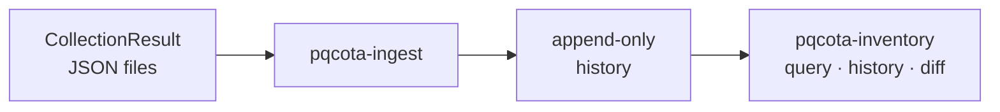

English · [한국어](README.md)

# Inventory — central inventory (stage 2)

> 🌐 Translated from the Korean original. If the two differ, the [Korean version](README.md) is authoritative.

**Ingests, persists, and serves** the observations Discovery produced. It accumulates repeated collections into an asset history and attaches machine metadata (endpoints, profiles) and **app attribution**, turning "what uses which cryptographic algorithm, and where" into a queryable inventory.

> **§ notation**: unless stated otherwise, these are section numbers in the [process regulation](../docs/regulation.en.md).

## At a glance



## What it consists of

| Piece | What it is |
|---|---|
| **Ingest** — `pqcota-ingest` | normalizes retrieved results and appends them to the history. This is the only write path |
| **History** | a snapshot at every point of change. Append-only, so earlier observations are never overwritten |
| **Machine metadata** | endpoints and profiles (environment, role, owner). **Access secrets are not persisted** |
| **Query** — `pqcota-inventory` | latest state, history, and diffs between snapshots. Read-only |

**Assets have three layers: machine → app → process.** An app is uniquely identified by `(node_id, app_key)`; a process is volatile, so it is not stored and is resolved on demand instead.

## Try it quickly

```bash
# ① ingest — read a directory of retrieved results
export PQCOTA_DSN='postgres://user:pw@host:5432/pqcota'
pqcota-ingest ./results

# ② query — latest state across all nodes
pqcota-inventory

# ③ history and change
pqcota-inventory -history node-01
pqcota-inventory -diff <older-id>,<newer-id>
```

A CBOM produced by an external tool, or a CMDB declaration, lands in the same history:

```bash
pqcota-cbom-ingest cbom.json cmdb://payment-gw     # a CBOM scanned by an external tool
pqcota-declare cmdb.csv --out ./declared && pqcota-ingest ./declared   # a CMDB declaration
```

To just collate files without a datastore, use `pqcota-discover-view ./results`. Per-command arguments → [inventory/cmd](cmd/README.md) (Korean).

## What comes in

**The command differs by origin**, and so does the detection method recorded alongside it.

| Where it came from | Command | How it was seen → evidence strength |
|---|---|---|
| **Observed directly by a [collector](../discovery/README.en.md)** | `pqcota-ingest` | **a running process was observed directly** (`runtime_introspection`) → `confirmed`<br>if JVM attach was blocked and only files were read, `artifact` → `inferred_high` |
| **A CBOM scanned by an external tool** (CBOMkit and friends) | `pqcota-cbom-ingest` | **a build artifact was read** (`artifact`) → `inferred_high` |
| **A record nobody scanned** (CMDB, an existing inventory) | `pqcota-declare` → `pqcota-ingest` | **never seen** — empty (`unspecified`) → no strength |

The first two are **actually observed, whoever collected them** — the strength just differs; seeing a running process beats reading a build artifact. The third has no observation at all and belongs to a different lane entirely: if written-down assumptions mix with observed facts, you can no longer tell apart "the CMDB says so but it was never observed." That distinction is the baseline for reconciliation.

Only **how it was seen** (`detection_method`) is recorded. **Strength (`evidence_strength`) is not stored — it is recomputed from that every time**, so that when the derivation rule improves, past results are read under the same rule. The full value list is in the [contract](../contracts/data-model.en.md).

## If you need more

The asset model, identity resolution, retention decisions, and the reasoning behind asset scope → **[Inventory design](design.en.md)**.

## This folder

- [`cmd/`](cmd) — entry points for central ingest, query, and metadata → [command map](cmd/README.md) (Korean)
- **Design docs**: [Inventory design](design.en.md) · [delegated CBOM intake](cbom-intake.md) · [test cases](testcases.md) (Korean)

## See also

Regulation §3 · [architecture](../docs/architecture.en.md) · view, store, and declaration-import libraries [`pkg/inventory/`](../pkg/inventory) · runnable examples [`examples/inventory/`](../examples/inventory)
