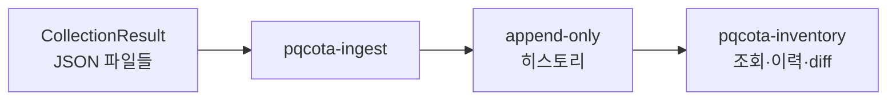

# Inventory — 중앙 인벤토리 (2단계)

> **§ 표기**: 별도 언급이 없으면 [프로세스 규정서](../docs/PQC플랫폼_단계별_프로세스규정.md)의 절 번호다.

디스커버리가 낸 관측을 **중앙에 적재·영속·조회**한다. 여러 번의 수집을 누적해 자산 히스토리를 만들고, 머신 메타데이터(엔드포인트·프로필)와 **앱 귀속**을 붙여 "무엇이 · 어디서 · 어떤 암호 알고리즘을 쓰는지"를 조회 가능한 인벤토리로 만든다.

## 한눈에



## 무엇으로 이루어지나

| 요소 | 무엇 |
|---|---|
| **적재** — `pqcota-ingest` | 회수한 결과를 정규화해 히스토리에 쌓는다. 여기가 유일한 쓰기 관문이다 |
| **히스토리** | 변화 지점마다 스냅샷. append-only라 지난 관측이 덮이지 않는다 |
| **머신 메타데이터** | 엔드포인트·프로필(환경·역할·소유자). **접근 비밀은 영속하지 않는다** |
| **조회** — `pqcota-inventory` | 최신 상태·이력·스냅샷 간 diff. 읽기 전용이다 |

**자산은 머신 → 앱 → 프로세스 세 층이다.** 앱은 `(node_id, app_key)`로 유일하게 식별되고, 프로세스는 휘발적이라 저장하지 않고 그때그때 해소한다.

## 간단히 써보기

```bash
# ① 적재 — 회수한 결과 디렉터리를 읽는다
export PQCOTA_DSN='postgres://user:pw@host:5432/pqcota'
pqcota-ingest ./results

# ② 조회 — 전 노드 최신 상태
pqcota-inventory

# ③ 이력·변화
pqcota-inventory -history node-01
pqcota-inventory -diff <과거id>,<최신id>
```

외부 도구가 낸 CBOM이나 CMDB 선언을 넣는 것도 같은 히스토리로 들어간다:

```bash
pqcota-cbom-ingest cbom.json cmdb://payment-gw     # 외부 도구가 스캔한 CBOM
pqcota-declare cmdb.csv --out ./declared && pqcota-ingest ./declared   # CMDB 선언
```

저장소 없이 파일만 취합해 보려면 `pqcota-discover-view ./results`. 커맨드별 인자는 [inventory/cmd](cmd/README.md).

## 무엇이 들어오나

어디서 왔는지에 따라 **넣는 커맨드가 다르고**, 함께 기록되는 관측 방법도 다르다.

| 어디서 왔나 | 넣는 커맨드 | 어떻게 봤나 → 증거 강도 |
|---|---|---|
| **[collector](../discovery/README.md)가 직접 관측한 것** | `pqcota-ingest` | **실행 중인 프로세스를 직접 관측했다**(`runtime_introspection`) → `confirmed`<br>JVM attach가 막혀 파일만 읽었으면 `artifact` → `inferred_high` |
| **외부 도구가 스캔한 CBOM**(CBOMkit 등) | `pqcota-cbom-ingest` | **빌드 산출물을 읽었다**(`artifact`) → `inferred_high` |
| **아무도 스캔하지 않은 기록**(CMDB·기존 인벤토리) | `pqcota-declare` → `pqcota-ingest` | **본 적 없다** — 비어 있음(`unspecified`) → 강도 없음 |

앞의 둘은 **누가 수집했든 실제로 관측된 것**이다 — 다만 강도는 다르다. 실행 중인 것을 직접 본 쪽이 빌드 산출물만 읽은 쪽보다 강하다. 셋째는 관측 자체가 없어 계열이 아예 다르다: 적어둔 추정이 관측된 사실과 섞이면 나중에 "CMDB엔 있다는데 관측되지 않았다"를 가려낼 수 없다. 이 구분이 대조의 기준선이다.

기록되는 값은 **어떻게 봤나**(`detection_method`)뿐이다. **강도(`evidence_strength`)는 저장하지 않고 거기서 매번 다시 계산한다** — 판정 규칙이 한곳에 있어야 나중에 규칙이 바뀌어도 과거 결과가 같은 기준으로 다시 읽힌다. 전체 값 목록은 [계약](../contracts/데이터모델_스키마.md).

## 더 알아야 한다면

자산 모델·동일성 해소·이력 보존 판정·자산 스코프의 근거 → **[인벤토리 설계](인벤토리_설계.md)**.

## 이 폴더

- [`cmd/`](cmd) — 중앙 적재·조회·메타데이터 실행 진입점 → [커맨드 지도](cmd/README.md)
- **설계 문서**: [인벤토리 설계](인벤토리_설계.md) · [위임 수신 설계](위임수신_설계.md) · [테스트케이스](인벤토리_테스트케이스.md)

## 더 보기

프로세스 규정서 §3 · [아키텍처 설계](../docs/PQC플랫폼_아키텍처_및_OSS경계_설계.md) · 뷰·저장소·선언 임포트 라이브러리 [`pkg/inventory/`](../pkg/inventory) · 실행 예제 [`examples/inventory/`](../examples/inventory)
