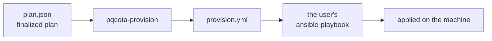
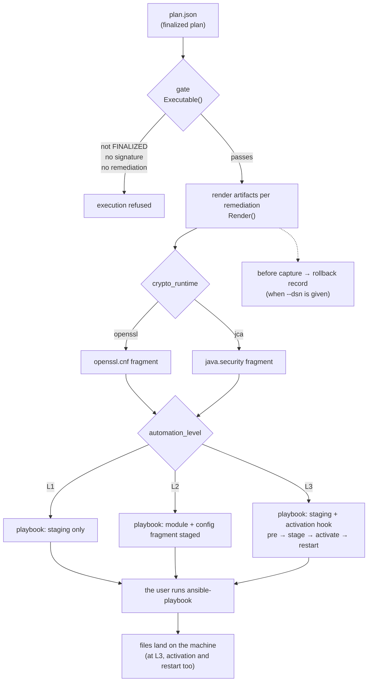

English · [한국어](README.md)

# Provisioning — generating migration artifacts (stage 3)

> 🌐 Translated from the Korean original. If the two differ, the [Korean version](README.md) is authoritative.

Takes a **finalized plan** (`FinalizedPlan`) as input and generates PQC migration artifacts — config fragments, Ansible playbooks (**you choose how far they go** — L1 stages the module, L2 adds the config, L3 activates and restarts; **both apply and rollback**), and the basis for undoing (before capture, rollback records).

> **§ notation**: unless stated otherwise, these are section numbers in the [process regulation](../docs/regulation.en.md).

What to change and how to undo it is **decided deterministically by the generator**; running the resulting playbook is done by the user's own Ansible. The plan is **written by the user** → [samples and fields](../examples/provisioning/plans/README.md) (Korean).

> **Scope** — two runtimes: **openssl** and **jca**. Anything else produces no artifact and says so (`# (unknown runtime)`). The output assumes POSIX file placement (staging plus Ansible `copy`/`absent`), so **the nodes are Linux**. CNG provisioning is [planned for v0.7.0](../RELEASE_NOTES.en.md#roadmap--upcoming-releases-planned).

## At a glance



**The tool generates the playbook and the config, and leaves behind the basis for undoing.** The actual application is run by the user with their own Ansible.

<details>
<summary><b>The full procedure — gate, runtime branch, level, rollback (expand)</b></summary>



</details>

## What it consists of

| Piece | What it is |
|---|---|
| **Input** — the finalized plan | JSON stating which node's what is to be changed to which provider. The user writes it → [samples and fields](../examples/provisioning/plans/README.md) (Korean) |
| **Generator** — `pqcota-provision` | reads the plan and produces config fragments and Ansible playbooks |
| **Output** — playbooks | one to apply, one to undo. Standard Ansible, so you run them with your own tooling |
| **Basis** — rollback records | given `--dsn`, the state *before* the remediation is recorded append-only → [`pqcota-records`](cmd/README.md) (Korean) |

## Try it quickly

```bash
# ① generate — build a playbook from the plan
pqcota-provision --level l2 plan.json > provision.yml

# ② apply — reuse the same targets.ini you used for discovery
ansible-playbook -i targets.ini provision.yml

# ③ undo — generate the reverse playbook from the same plan and run it
pqcota-provision --level l2 --rollback plan.json > provision-rollback.yml
ansible-playbook -i targets.ini provision-rollback.yml
```

All options, and where provider modules go → [provisioning/cmd](cmd/README.md) (Korean). Before anything runs, **the plan must pass the gate** — if `status` is not `PLAN_STATUS_FINALIZED`, or there are no approval signatures, or there is not a single remediation, nothing is generated.

## The two axes that decide the output

**`kind` decides "what", `automationLevel` decides "how far".** Their combination determines the output.

| `kind` | What that remediation stages (L1) | (L2) | (L3) |
|---|---|---|---|
| `CONFIG_ONLY` | nothing — **it starts at L2** | config fragment | config fragment + **activation and restart** |
| `PROVIDER_INJECT` | provider module | provider module + config fragment | module + config fragment + **activation and restart** |
| `FORK_REPLACE`·`PROXY_FRONT`·`REBUILD`·`JDK_UPGRADE`·`APP_RECONFIG`·`DECOMMISSION` | nothing — **at any level** | 〃 | 〃 |

The first row being empty at L1 and the last row being empty **mean different things.** The first is "not yet"; the last is "never" — which is why only the last row leaves **a comment in the playbook explaining why nothing is there.**

The activation and restart commands come from the plan's `activation` hook. Without the hook, that step is not generated even at L3.

```
    # remediation a2 (REMEDIATION_KIND_FORK_REPLACE): cannot be deployed via config — manual step (§4.3 legacy touch)
```


## When it doesn't work — symptom and cause

| Symptom | Cause |
|---|---|
| `plan not finalized — provisioning refused` | `status` is not FINALIZED, or `approvalSignatures` is empty |
| the playbook has no config fragment | you are on `--level l1`. Config starts at L2 |
| the fragment has `Groups`/`namedGroups` only as a comment | `targetAlgorithm` is not a KEM, or was not recognized |
| the playbook has the remediation only as a comment | that `kind` cannot be deployed via config (fork replacement, rebuild, and so on) |
| the provider class name comes out as `<…confirm>` | `providerChoice` is not in the BC family — replace it with the proper class name |
| `Could not find or access '…so'` (at run time) | the module source was not found — put it in `files/` or pass `-e pqcota_module_src_<name>=` |
| several providers but the same file was staged for all | you used the global `pqcota_module_src` — use per-provider variables or the `files/` convention |
| applied, but the negotiation is still classical | the fragment was **only staged** and never referenced or restarted (L3), or, on JCA, the provider sits late in the priority order |

## If you need more

What gets generated for a given version and provider situation, where it lands on the machine, and how activation and undo are symmetric → **[Provisioning design](design.en.md)**.

## This folder

- [`cmd/`](cmd) — entry points for generation and query → [command map](cmd/README.md) (Korean)
- **Design docs**: [Provisioning design](design.en.md) · [test cases](testcases.md) (Korean)

## See also

- Minimal runnable examples: [examples/provisioning](../examples/provisioning)
- End-to-end demo: [demo](../demo)
