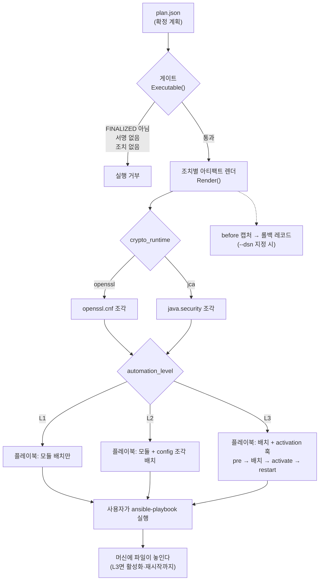

한국어 · [English](README.en.md)

# Provisioning — 전환물 생성 (3단계)

**확정된 계획**(`FinalizedPlan`)을 입력으로 받아 PQC 전환 아티팩트를 생성한다 — config 조각, Ansible 플레이북(**어디까지 갈지 고른다** — L1 모듈 배치 · L2 config까지 · L3 활성화·재시작까지, **적용·롤백 양방향**), 되돌림 근거(before 캡처·롤백 레코드).

> **§ 표기**: 별도 언급이 없으면 [규정서](../docs/regulation.md)의 절 번호다.

무엇을 바꿀지·어떻게 되돌릴지는 **생성기가 결정론적으로 정하고**, 만들어진 플레이북을 돌리는 것은 사용자의 Ansible이다. 계획은 **사용자가 작성한다** → [견본·필드](../examples/provisioning/plans/README.md).

> **대상 범위** — 런타임은 **openssl·jca** 둘이다. 그 밖은 아티팩트를 만들지 않고 그렇게 적는다(`# (unknown runtime)`). 생성물이 POSIX 파일 배치(스테이징 + Ansible `copy`·`absent`)를 전제하므로 **노드는 리눅스**다. CNG 프로비저닝은 [v0.7.0 계획](../RELEASE_NOTES.md#로드맵--예정-릴리스-계획)이다.

## 한눈에


**도구는 플레이북과 config를 생성하고 되돌릴 근거를 남긴다.** 실제 적용은 사용자가 자기 Ansible로 돌린다.

<details>
<summary><b>전체 절차 — 게이트·런타임 분기·레벨·롤백까지 (펼치기)</b></summary>



</details>

## 무엇으로 이루어지나

| 요소 | 무엇 |
|---|---|
| **입력** — 확정 계획 | 어느 노드의 무엇을 어떤 provider로 바꿀지 적은 JSON. 사용자가 쓴다 → [견본·필드](../examples/provisioning/plans/README.md) |
| **생성기** — `pqcota-provision` | 계획을 읽어 config 조각과 Ansible 플레이북을 만든다 |
| **산출** — 플레이북 | 적용용 하나, 되돌림용 하나. 표준 Ansible이라 자기 도구로 돌린다 |
| **근거** — 롤백 레코드 | `--dsn`을 주면 조치 *전* 상태를 append-only로 남긴다 → [`pqcota-records`](cmd/README.md) |

## 간단히 써보기

```bash
# ① 생성 — 계획에서 플레이북을 만든다
pqcota-provision --level l2 plan.json > provision.yml

# ② 적용 — 디스커버리에서 쓰던 targets.ini를 그대로 쓴다
ansible-playbook -i targets.ini provision.yml

# ③ 되돌림 — 같은 계획으로 역방향 플레이북을 만들어 돌린다
pqcota-provision --level l2 --rollback plan.json > provision-rollback.yml
ansible-playbook -i targets.ini provision-rollback.yml
```

옵션 전체와 provider 모듈을 어디 두는지는 [provisioning/cmd](cmd/README.md). 실행 전에 **계획이 게이트를 통과해야 한다** — `status`가 `PLAN_STATUS_FINALIZED`가 아니거나, 승인 서명이 없거나, 조치가 하나도 없으면 아무것도 생성되지 않는다.

## 결과를 가르는 두 축

**`kind`가 "무엇을", `automationLevel`이 "어디까지"** 를 정한다. 둘의 조합이 산출물을 결정한다.

| `kind` | 그 조치로 놓이는 것 (L1) | (L2) | (L3) |
|---|---|---|---|
| `CONFIG_ONLY` | 없음 — **L2부터 나온다** | config 조각 | config 조각 + **활성화·재시작** |
| `PROVIDER_INJECT` | provider 모듈 | provider 모듈 + config 조각 | 모듈 + config 조각 + **활성화·재시작** |
| `FORK_REPLACE`·`PROXY_FRONT`·`REBUILD`·`JDK_UPGRADE`·`APP_RECONFIG`·`DECOMMISSION` | 없음 — **어느 레벨에서도** | 〃 | 〃 |

첫 줄이 L1에서 비는 것과 마지막 줄이 비는 것은 **뜻이 다르다.** 첫 줄은 "아직"이고 마지막 줄은 "영영"이다 — 그래서 마지막 줄만 **왜 없는지가 플레이북에 주석으로 남는다.**

활성화·재시작 명령은 계획의 `activation` 훅에서 온다. 훅이 없으면 L3이어도 그 단계는 생성되지 않는다.

```
    # 조치 a2(REMEDIATION_KIND_FORK_REPLACE): config로 배포 불가 — 수동 단계(§4.3 레거시 터치)
```


## 잘 안 될 때 — 증상과 원인

| 증상 | 원인 |
|---|---|
| `plan not finalized — 프로비저닝 실행 거부` | `status`가 FINALIZED가 아니거나 `approvalSignatures`가 비었다 |
| 플레이북에 config 조각이 없다 | `--level l1`이다. config는 L2부터 |
| 조각에 `Groups`/`namedGroups`가 주석으로만 있다 | `targetAlgorithm`이 KEM이 아니거나 인식되지 않았다 |
| 플레이북에 조치가 주석으로만 있다 | 그 `kind`는 config로 배포할 수 없다(포크 교체·재빌드 등) |
| provider 클래스명이 `<…확인>` 으로 나온다 | `providerChoice`가 BC 계열이 아니다 — 정식 클래스명으로 교체해야 한다 |
| `Could not find or access '…so'` (실행 시) | 모듈 소스를 못 찾았다 — `files/`에 두거나 `-e pqcota_module_src_<이름>=` 지정 |
| 여러 provider인데 전부 같은 파일이 배치됐다 | 전역 `pqcota_module_src`를 썼다 — provider별 변수나 `files/` 관례로 |
| 적용했는데 여전히 고전으로 협상된다 | 조각이 **배치만** 됐고 참조·재시작(L3)이 안 됐거나, JCA라면 provider 우선순위가 뒤에 있다 |

## 더 알아야 한다면

버전·provider 상황에 따라 무엇이 생성되는지, 머신 어디에 놓이는지, 활성화·되돌림이 어떻게 대칭인지 → **[프로비저닝 설계](design.md)**.

## 이 폴더

- [`cmd/`](cmd) — 생성·조회 실행 진입점 → [커맨드 지도](cmd/README.md)
- **설계 문서**: [프로비저닝 설계](design.md) · [테스트케이스](testcases.md)

## 더 보기

- 최소 실행 예제: [examples/provisioning](../examples/provisioning)
- 종단 시연: [demo](../demo)
