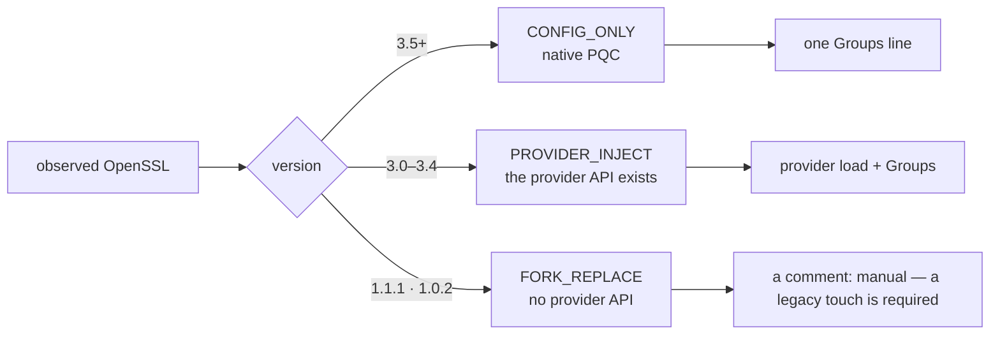
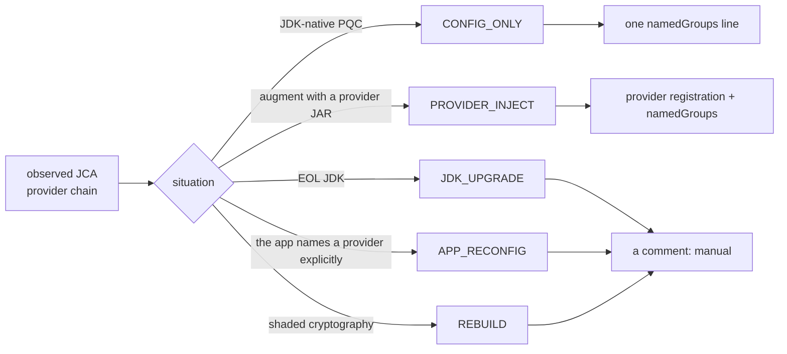
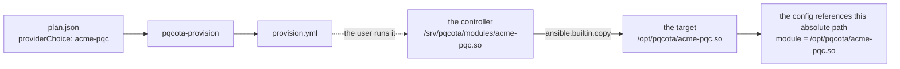

English · [한국어](design.md)

# Deploy / Provisioning subsystem design

> 🌐 Translated from the Korean original. If the two differ, the [Korean version](design.md) is authoritative.

**Rules covered**: regulation §4 (DEPLOY provisioning) · §3.7 (the Inventory→Deploy gate) · architecture §5 (the OSS boundary).
**Scope**: the part that takes a finalized plan (`FinalizedPlan`) as input and **generates remediation artifacts**. It does not do fleet orchestration (drain, rolling, health-check gates).

> **In one line**: it **generates "what to deploy".** It does not orchestrate "how to push that safely across a fleet". This moves §4.1's "the reviewer owns what and in what order (the plan layer) / the platform owns how, safely (the execution layer)" into a code boundary.


> **§ notation**: unless stated otherwise, these are section numbers in the [process regulation](../docs/regulation.en.md).

**Which rules this implements** — when the regulation changes, this table finds the sections to fix.

| This document | The regulation |
|---|---|
| 1. Component architecture | §4.1 purpose and boundary |
| 2. Data model | §4.4 the plan schema |
| 3. The execution gate | §3.7 the Inventory→Deploy gate |
| 4. The artifact generator | §4.2 the core strategy · §4.3 the remediation taxonomy |
| 5. Staged deployment L1/L2/L3 | §4.3 the staged deployment model |
| 6. The closed loop | §4.3 (re-observation after remediation) |
| 6A. History and rollback | §1.3 the provenance chain |
| 9. The GPL and signing boundary | (licensing is in the [license notes](../docs/licensing.en.md)) |

---

## 0. The axes that separate situations

| Axis | Values | Effect |
|---|---|---|
| Runtime | OpenSSL / JCA (Java) | branches the artifact (§4.3/§4.4) |
| Remediation kind | config-only / provider-inject / **non-config (fork-replace)** | whether generation is possible at all, and honesty (§4.3) |
| Deployment level | L1 stage / L2 install / L3 activate | a stage boundary is a rollback point (§4.3) |
| Environment | standard / air-gapped / **regulated (FIPS)** | the deployment channel and provider routing |
| Undo | before capture → the rollback playbook | §6A |

---

## 1. Component architecture

```
[FinalizedPlan]  ──the Executable() gate (§3.7)──▶  [artifact generator]  ──▶  config fragments / playbooks
   (authoring, review-finalize engine)   (a shared rule)      (pkg/provisioning)              │
                                                                                 ▼
                                                              [the execution channel §4.3]
```

| Component | Location | Scope | Role |
|---|---|---|---|
| The plan schema (`FinalizedPlan`, `RemediationAction`) | `contracts/.../provisioning/v1/plan.proto` | **OSS** (SSOT) | the vocabulary every component shares |
| The execution gate (`Executable`) | `pkg/provisioning/plan.go` | **OSS** | the §3.7 contract rule, "only a finalized plan is grounds for execution" |
| The artifact generator (`Render`, OpenSSL, JCA) | `pkg/provisioning/{render,openssl,jca}.go` | **OSS** | the taxonomy (§4.3/§4.4) → config fragments |
| L1/L2/L3 deployment playbooks | `pkg/provisioning/ansible.go`, `stage.go`, `rollback.go` | **OSS** | standard-substrate stage/install + the plan's activation hook (§4.3) |

**Why the generator is OSS**: the §4.3/§4.4 taxonomy is a deterministic mapping (asset state → remediation → config fragment), which makes it a derivation rule (§1.2). Same layer as the enrichment pipeline and posture classification — the rule lives in one place (the core) and must be recomputable.

---

## 2. Data model (`contracts/.../provisioning/v1/plan.proto`)

### 2.1 The plan lifecycle — `PlanStatus`

`draft → in-review → finalized`. **Only FINALIZED is grounds for provisioning to run** (the strongest gate, §3.7). Partial finalization per ring or domain is allowed.

### 2.2 The remediation taxonomy — `RemediationKind`

The "what" a reviewer decides from asset state (the plan layer). The generator branches on this value.

| kind | For | Config generated |
|---|---|---|
| `CONFIG_ONLY` | OpenSSL 3.5+ / a native JDK | ✅ group activation only |
| `PROVIDER_INJECT` | OpenSSL 3.0–3.4 / a JCA provider JAR | ✅ provider load + activation |
| `FORK_REPLACE` | OpenSSL 1.1.1, 1.0.2 | ❌ non-config (replacement) |
| `PROXY_FRONT` | an alternative that leaves the legacy untouched | ❌ a separate proxy |
| `REBUILD` | static, vendored, shaded | ❌ a CI rebuild |
| `JDK_UPGRADE` | an EOL JDK | ❌ an upgrade |
| `APP_RECONFIG` | apps pinning a group or naming a provider explicitly | ❌ an app code change |
| `DECOMMISSION` | EOL, low value | ❌ retire or accept |

### 2.3 One remediation — `RemediationAction`

`target_node_id` (the §1.4 anchor) · `finding_id` (the basis) · `crypto_runtime` (the openssl/jca branch) · `kind` · `automation_level` (L1/L2/L3) · `target_algorithm` (produced by posture.Remediate) · `provider_choice` (the §4.4 routing) · `config_artifact` (the generator's output) · `activation` (the L3 hook) · `rollback_note` · `priority`.

### 2.4 The finalized plan — `FinalizedPlan`

`status` · `scope` (ring/domain) · `actions` (**order is meaningful**, §4.1) · `approval_signatures` (§3.3③) · `derived_from_snapshot_id` and `ruleset_version` (§1.2 reproduction).

> The `DeployAutomationLevel` enum comment's "belongs to the finalized plan" means *workflow ownership*. The *type definition* is SSOT and therefore OSS (stated in inventory design §2). Not a conflict — the type lives in the contract, the authoring workflow lives on the plan side.

---

## 3. The execution gate (`pkg/provisioning/plan.go`)

`Executable(plan) error` — the **shared contract rule** validating that a finalized plan is valid grounds for execution:
- `status == FINALIZED` (otherwise refused)
- at least one `approval_signatures` (the §3.3③ precondition of finalize)
- at least one `actions`

It is not a derivation but the gate immediately before execution. Passing this function does not cause execution — it only settles the rule of "what counts as grounds for execution".

---

## 4. The artifact generator

`Render(action) string` — branches on `crypto_runtime`; `FillPlan(plan)` fills in `config_artifact` for every remediation (materializing the diff under review). **The core strategy (§4.2)**: without raising the version, replace only the algorithm capability by injecting a provider → the remediation shrinks from "replace the library" to "stage the provider + activate + verify" (atomic and reversible).

### 4.1 The OpenSSL branch (`openssl.go`) — the version determines the `kind`

**Asset state → remediation.**

| Asset state | Remediation | Legacy touch |
|---|---|---|
| 3.5+ / dynamic | config only (activate the hybrid) | not needed |
| 3.0–3.4 / dynamic | **inject an internal provider + config** | not needed (one line of cnf to roll back) |
| 1.1.1, 1.0.2 / dynamic | fork replacement **or** proxy fronting | replacement = needed / proxy = not needed |
| static, vendored | rebuild (CI) **or** a proxy | rebuild = needed |
| EOL, low value | retire or accept the risk | not needed |

The verification matrix: does the provider advertise `OSSL_CAPABILITY_TLS_GROUP`, does the app avoid pinning the group or TLS version, and on a 3.5 host avoid duplication (config only).



**`CONFIG_ONLY` (3.5+)** — turn on the group without touching the legacy runtime or any provider:

```ini
# generated by pqcota: OpenSSL 3.5+ config-only — activate the ML-KEM (FIPS 203) hybrid (§4.3)
# legacy and providers untouched. Rollback = remove this fragment.
openssl_conf = openssl_init

[openssl_init]
ssl_conf = ssl_sect
…
[system_default_sect]
Groups = X25519MLKEM768:x25519
```

The first line comes before any section. Without it OpenSSL **does not read** `[openssl_init]` — in an environment that points `OPENSSL_CONF` straight at the fragment, it would be staged and would pass the sha256 gate while the capability stayed exactly as it was. In an environment that `.include`s it from the system cnf, the same value is simply assigned once more, harmlessly.

**`PROVIDER_INJECT` (3.0–3.4)** — **leave the version alone** and augment only the algorithm capability with a provider module. Leave `providerChoice` empty and `oqsprovider` is the default:

```ini
[provider_sect]
default = default_sect
oqsprovider = oqsprovider_sect

[oqsprovider_sect]
activate = 1
module = oqsprovider.so
…
Groups = X25519MLKEM768:x25519
```

> **The `:x25519` tail on `Groups`** is the classical fallback. PQC is preferred, but a peer that does not support it still connects.

### 4.2 The JCA branch (`jca.go`) — the JDK generation and the provider determine the `kind`

**Asset state → remediation.**

| Asset state | Remediation | Legacy touch | The OpenSSL counterpart |
|---|---|---|---|
| a JDK with native PQC | config only (`java.security` order, `jdk.tls.*`) | not needed | 3.5 config-only |
| an unsupported JDK where a provider can be injected | **stage the provider JAR + register it in java.security** | not needed (no redeploy) | 3.x provider injection |
| apps naming a provider explicitly or registering dynamically | **an app code or config change is required** | needed | the group-pinned app reconfig |
| an EOL JDK | a JDK upgrade or proxy fronting | upgrade = needed | 1.1.1 fork replacement / proxy |
| shaded cryptography | a rebuild | needed | static/vendored rebuild |

JCA-specific verification: did the injected provider **actually enter the dispatch chain** (is a higher-priority provider intercepting it), apps using `getInstance("...","BC")` make config moot, and compute the **blast radius of a global `java.security` change**.

**Provider candidates and how to choose** — which provider to inject in Java is routed by the nature of the asset.

| Asset nature | Recommended provider | Rationale |
|---|---|---|
| a general asset on an older JDK (<24) | **BouncyCastle** (bcprov-jdk18on) | covers every JDK, standard JCA API, permissive license |
| **a regulated asset** | **BC-FJA (FIPS 140-3)** | closes the FIPS gap of an in-house provider, satisfies audit |
| a newer JDK (24/25+) with no SLH-DSA need | JDK native | no provider injection needed, config only |
| wanting to converge on an OpenSSL backend | openssl-jostle | converges the two runtimes on one provider |
| special algorithms, an HSM, or independent control | an in-house PQC provider | see below |

**Positioning an in-house provider**: since BC offers the three standard algorithms through the standard API and even has a FIPS-certified edition (BC-FJA), there is little justification for implementing standard PQC ourselves on the Java side. **The value of an in-house provider is limited to (a) special requirements of the OpenSSL runtime, (b) proprietary algorithms or HSM integration BC does not support, and (c) licensing or supply-chain control reasons.** If the goal is purely to bring standard PQC to Java, adopting BC beats reinvention, and the in-house provider concentrates on OpenSSL and special cases.

**A licensing note**: the standard BouncyCastle edition is under a permissive MIT-family license, so bundling or integrating it directly carries no copyleft contagion (it is not among the GPL-isolated items in the [license notes](../docs/licensing.en.md)). The BC-FJA (FIPS) variant may carry separate license and contract terms, though, so check before adopting it for regulated assets.



**`CONFIG_ONLY`** — the negotiation group only, no provider registration:

```properties
# generated by pqcota: JDK-native PQC config-only — ML-KEM (FIPS 203) (§4.4)
jdk.tls.namedGroups=X25519MLKEM768,x25519
```

**`PROVIDER_INJECT`** — stage the JAR + register it in `java.security`. `providerChoice` decides the class name:

| `providerChoice` | The class registered |
|---|---|
| `BC` (default) | `org.bouncycastle.jce.provider.BouncyCastleProvider` |
| `BCFIPS` · `BC-FJA` | `org.bouncycastle.jcajce.provider.BouncyCastleFipsProvider` |
| anything else | `<name: confirm the proper class name in the provider's documentation>` + a **⚠ placeholder warning** |

> A placeholder buried in the fragment is easy to miss, so when `pqcota-provision` meets such a remediation it
> **prints a ⚠ on stderr** (`remediation …: provider_class undetermined …`). The plan is still valid and the playbook is
> still generated normally, so execution is not blocked — the "generate → a person writes the FQCN → apply" path stays
> open; it just makes sure an incomplete output does not pass **silently**.

**For a custom provider, write the FQCN into `providerClass`** — then it completes with no placeholder and no warning:

```json
{"providerChoice": "acme-jce", "providerClass": "com.acme.jce.AcmeProvider"}
```
→ `security.provider.2=com.acme.jce.AcmeProvider`

OpenSSL has no such field. There you only need the **path**, and the generator decides that path; JCA, though, requires an **FQCN** in java.security, and package structure differs per vendor so it cannot be derived from the provider name.

**To let the JVM find the JAR** it has to be on the classpath — the extension mechanism (`$JAVA_HOME/jre/lib/ext`) was **removed in JDK 9**, so on 9+ use the classpath or `--module-path`. The generated fragment states both, along with the actual staged path. This wiring is the common trap of **staging a JAR ≠ loading it**, so when there is a JCA injection the warning is also raised **at the top of the playbook header** (visible without opening the fragment). The wiring itself depends on how the app starts, so it is written into the plan's `activation.activate` hook (L3) — the tool does not guess how something starts.

```properties
security.provider.2=org.bouncycastle.jce.provider.BouncyCastleProvider
# ↑ priority 2 — so PQC algorithms dispatch first (acceptance principles §2.2(d), order negotiation).
# ⚠ This line **replaces slot 2** (it does not insert). The provider that used to be 2 drops off
#   the list — on JDK defaults that is usually SunRsaSign, and then RSA services move to this provider.
jdk.tls.namedGroups=X25519MLKEM768,x25519
```

> **Why slot 2**: in JCA, **the earlier provider in the list services first**. Register it later and, BouncyCastle present or not, the existing provider keeps handling everything and **nothing changes**.
>
> **It takes the slot instead**: measured on JDK 21, setting `security.provider.2` to this value keeps the provider list at 12 entries with only `SunRsaSign` gone. To avoid displacing anything you would have to shift the later numbers down by one in the target's `java.security` first, which requires knowing that node's original file — so the tool does not do it for you. Check it yourself: [`verify-registration.sh`](../examples/provisioning/files/README.md) (Korean).
>
> **The fallback group is not decoration**: give `jdk.tls.namedGroups` **only unknown groups** and JSSE fails at initialization (measured: `ExceptionInInitializerError` on both JDK 21 and 25 — released JDKs do not know this group yet). So a classical group is always kept alongside.


### 4.3 `targetAlgorithm` builds the group name

The algorithm family is found in the `targetAlgorithm` string and the **TLS hybrid group name** is derived from it:

| `targetAlgorithm` example | Derived group |
|---|---|
| `ML-KEM (FIPS 203)`, `MLKEM768` | `X25519MLKEM768` |
| `Kyber768` | `X25519Kyber768Draft00` (the predecessor, a draft) |
| a **signature** algorithm such as `ML-DSA (FIPS 204)` | **none** — groups apply only to KEMs |
| an unrecognized string | **none** |

When no group can be built it **does not guess**; it writes this into the fragment instead:

```
# Groups: the target is not a KEM hybrid group (a signature, or unknown) — specify it manually
```


### 4.4 Backward compatibility and honesty rules

- **A classical fallback rides alongside the hybrid group** (`X25519MLKEM768:x25519`) — old clients keep connecting (the §4.3 verification matrix).
- The target wire group name is derived through `registry.MatchPQC` (ML-KEM→`X25519MLKEM768`). For a signature or unknown algorithm, the absence of a KEM group is stated in a comment.
- A provider class that cannot be determined gets a placeholder plus a "confirm the proper class name" warning (no guessed injection).

---

## 5. Staged deployment — L1/L2/L3

### 5.1 What lands on the machine

When the user runs the generated playbook:

| What | Where | Condition |
|---|---|---|
| the provider module | `/opt/pqcota/<provider>.so` (`.jar` for JCA) | `PROVIDER_INJECT` — the source is [pushed from the controller](#6b-a-custom-provider) |
| the OpenSSL config fragment | `/etc/pqcota/openssl-pqc.cnf` | L2 |
| the JCA config fragment | `/etc/pqcota/java.security.pqcota` | L2 |
| (when there are several fragments) | split per remediation, as in `…/openssl-pqc.<action-id>.cnf` | two or more fragments with **different content** for the same runtime on one node |

Staging twice at one path would let the later overwrite the earlier and the earlier remediation would silently vanish, so in that case the paths are split and the fact is reported. They are not merged into one file — sections can conflict, and having the tool decide the merge order would be a judgment. Which fragment gets referenced is decided by `activation.activate`.

**Everything is a new file.** The existing `openssl.cnf` and `java.security` are never overwritten — which is why undoing is just **removing files**.

#### Which machine it lands on — `node_id` *is* the Ansible inventory host

The plan's `targetNodeId` becomes the playbook's target directly — the output comes out as `hosts: ["<node_id>"]` (plan strings are always quoted so a `:` in a name cannot break the YAML). `node_id` is an **identity anchor**, not an IP (§1.3 — an IP is only a locator), so tying that name to an actual connection (IP, SSH user, key) is **the user's Ansible inventory**. That inventory is the `targets.ini` (runtime-only, 0600) `pqcota-hosts` generates from `hosts.csv`, mapping each `node_id` to `ansible_host`, `ansible_user`, and a key. That is:

```
plan.targetNodeId ─┐
                   ├─(the same node_id)→  ansible-playbook -i targets.ini provision.yml
a targets.ini entry ┘         (node_id → ip and ssh connection are resolved here)
```

So the tool neither needs to know a connection secret nor to persist one — the playbook says only `node_id`, and how to reach that node is the inventory's business (see `pqcota-hosts` in the [discovery examples](../examples/discovery/README.md) (Korean)).


### 5.2 Activation — stop at L2, or finish at L3

Even with the files in place, **nothing has changed yet.** The fragment has to be referenced by the real configuration and the service restarted for it to take effect. How far to go is decided by `--level`.

**Stopping at L2 leaves every output fully reversible** — nothing overwrote an original, so deleting the files you placed is enough, and the service was never touched. Use it when you want to defer the risky step and confirm staging first.

**L3 goes all the way.** The activation and restart commands are **what is written** in the plan's `activation` hook — the activation point differs per environment (a systemd drop-in, an include directory, an in-house startup script), so the tool does not guess. What the generator does is place them in **a meaningful order**:

```
forward : pre → stage the module and config → activate → restart
rollback: pre → deactivate → remove the staged files → restart
```

When a hook is empty that step is not generated, and stderr says what will *not* happen. Even with several remediations on one node the same command goes out only once — restarting per remediation would shake the service repeatedly, and a restart landing between activations would bring it up only partly applied.

```bash
pqcota-provision --level l3 plan.json > provision.yml
pqcota-provision --level l3 --rollback plan.json > provision-rollback.yml
```

Switching **many nodes in sequence while preserving availability** (drain, rolling, health-check gates, automatic rollback decisions) is not done here — L3 goes as far as one node.


**A stage boundary is a gate and a rollback point.** L3 goes as far as activating and restarting one node — switching many nodes in sequence while preserving availability (drain, rolling, health checks) belongs to the user's orchestration layer.

---

## 6. The closed loop (Deploy → Discovery)

After L3, **a rescan confirms the state change** (§4.3). The change Deploy made (a new provider loaded, a group negotiated) is observed again by the network collector and the openssl/jvm collectors → inventory reconciliation updates it to CONFIRMED, and on drift a new review item is created. In other words **Deploy's verification is re-running Discovery**, and this closed loop stands up on the discovery and inventory core that already exists.

---

## 6A. Provisioning history and rollback (contract: `provisioning/v1 rollback.proto`)

Preserving the state *before* provisioning is what makes **rollback** possible (§1.3, the action lane; §4.3, a stage boundary is a rollback point).

- **`CryptoState`** (before/after) — an application's crypto state at a point in time: `modules` (module + version, e.g. `libcrypto.so.3@3.0.13`, `oqsprovider@0.6`), `config_digest`, `provider_chain`, `config_snapshot_ref` (a reference to the original config text, for rollback).
- **`ProvisioningRecord`** — the **append-only history** of one provisioning act: `(node_id, app_keys, action_id, plan_id)` + `before` (the rollback baseline) and `after` + `ProvisioningStatus` (staged/installed/activated/rolled_back/failed). `app_keys` is plural — replacing a shared library affects every app that loads it, so the blast radius is recorded in full (inherited from Finding.app_keys).
- **What this repo writes is `before` plus `STAGED`, and no further** — and only when `--dsn` is given. Without it, nothing is captured or persisted and only the playbook is emitted (`pqcota-provision` says so on stderr). `after` and the remaining states (installed, activated, rolled_back, failed) are filled by **whoever runs the application**. This repo does not run Ansible, so it has no way of knowing the outcome (§5, the boundary). The contract models the whole lifecycle for the sake of whatever picks it up downstream.
- **Rollback** = restoring `before` (staging the old module and config) + **a controlled restart**. On failure (boot verification failing, say) or at the user's request. There is a rollback point at every stage boundary (§4.3).
- **Safety**: rather than *overwriting an existing crypto module in place* (which risks mmap corruption), the new module is staged atomically and the before module and config are preserved → restorable at any time. Activation happens only on restart (nothing is applied dynamically, §5).
- **Generating the rollback playbook (symmetrical with forward)**: it does not stop at leaving a before record — `GenerateRollbackPlaybook` generates the **reverse playbook**. Because forward *adds* files instead of overwriting originals (see safety above), **removing** (`state: absent`) that config fragment and staged module restores the before state — no need to regenerate the original text. At L3 the `deactivate` hook also undoes the activation, making it exactly symmetrical with forward.
- **Symmetry**: rollback deletes what forward placed. At L3 it undoes activation too — and if there is no `deactivate` hook only the files are deleted, so that fact is warned about (§2.5).
- **Implementation**: `CaptureState(findings)→CryptoState` in `capture.go` (openssl lib@version, the JCA provider) plus `NewProvisioningRecord(...)` (before capture, STAGED). `RecordStore` (Mem/Pg, append-only, queried with `ByNode`). The rollback playbook generator is `GenerateRollbackPlaybook` in `rollback.go` (the reverse of forward's `stage.go`). The consumer is `pqcota-provision` (provisioning/cmd): `FinalizedPlan` JSON → the §3.7 gate → generate the L1/L2 playbook (reverse with `--rollback`) + per-remediation before capture and app_keys attribution → persist the record.

---

## 6B. A custom provider

The path for deploying an in-house build or a special-algorithm module. `providerChoice` becomes **the basis for the file name, the staging path, and the Ansible variable name**.



The three ways to tell it where the module is (the `files/` convention, a per-provider variable, a global variable) and the sha256 integrity gate are in [provisioning/cmd § applying](cmd/README.md) (Korean). Which names `providerChoice` accepts is in [samples · fields](../examples/provisioning/plans/README.md) (Korean).

**The config references an absolute path.**

```ini
[acme-pqc_sect]
activate = 1
module = /opt/pqcota/acme-pqc.so
```

With a relative name (`acme-pqc.so`) OpenSSL looks in the **module directory** (`OPENSSL_MODULES`, or the build-time `MODULESDIR`), which is not where the playbook puts it. Whoever knows the staging location writes the path.

> ⚠ **A FIPS note**: an in-house or custom provider is **not FIPS-validated**. For a regulated asset, route to a validated provider.

## 7. Scope boundary summary (this stage)

| Element | This repo |
|---|---|
| The plan/remediation schema | ✅ contracts |
| The execution gate rule | ✅ `Executable` |
| Taxonomy → config fragments | ✅ the generator |
| L1/L2/L3 artifacts | ✅ playbooks (apply and roll back, both directions) |
| Plan authoring and review-finalization | ❌ not done |
| Fleet orchestration (drain, rolling, health gates) | ❌ not done — this repo goes as far as activating one node (§5.2) |
| Signature provenance | as far as the format and verification functions. Comparing against registered keys and refusing is not done |

> Plan authoring, review-finalization, declaration reconciliation, and fleet orchestration are not done — they are joined only through the contract (`plan.proto`).

**Note**: the standard BouncyCastle edition (MIT family) is not among the GPL-isolated items (it can be bundled). BC-FJA (FIPS) has separate contract terms to check (§4.4).

---

## 8. Open design questions

- **Storing vs regenerating config_artifact**: today `FillPlan` materializes it (for review convenience). Being derived, storing it is only a cache — a regeneration policy is needed when the rule improves (§1.2).
- **A provider class registry**: whether to register the proper class names of providers beyond BC/BCFIPS (jostle, in-house) in `pkg/kernel/registry` (today: a placeholder plus a warning).
- **Verification artifacts at the L2/L3 boundary**: how far boot verification (the new provider loading, entering dispatch) can be expressed as core rescan rules.

---

## 9. The GPL and signing boundary

- **An Ansible playbook is data** (not linked or bundled code), so it has nothing to do with GPL contagion → **generating** playbooks is legitimate (§4.3 · [license notes](../docs/licensing.en.md)).
- **The standard BouncyCastle edition** (MIT family) is not among the GPL-isolated items (it can be bundled). **BC-FJA (FIPS)** has separate contract terms to check (§4.4).
- **Signature provenance**: the format and verification functions live in this repo (`pkg/kernel/sign`). Comparing against registered keys and refusing is not done.
