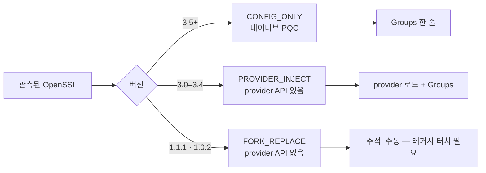
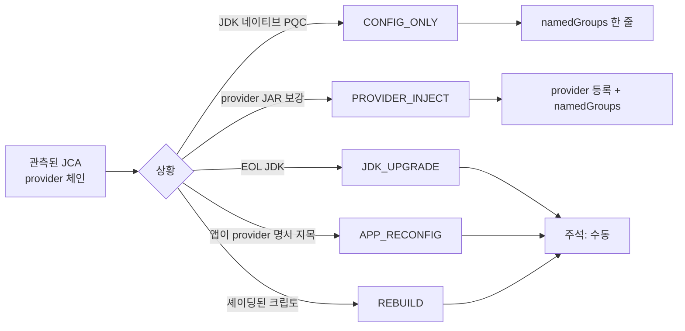
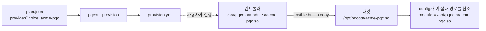

# 배포 서브시스템 설계 (Deploy / Provisioning Subsystem Design)

**대상 규정**: 규정서 §4(DEPLOY 프로비저닝) · §3.7(Inventory→Deploy 게이트) · 아키텍처 §5(OSS 경계).
**범위**: 확정 계획(FinalizedPlan)을 입력으로 받아 remediation **아티팩트를 생성**하는 부분. 플릿 오케스트레이션(drain·rolling·헬스체크 게이트)은 하지 않는다.

> **한 줄**: **"무엇을 배포할지"를 생성한다.** "어떻게 안전하게 fleet에 미는지"의 오케스트레이션은 하지 않는다. §4.1의 "리뷰어=무엇을·어떤 순서로(계획 레이어) / 플랫폼=어떻게 안전하게(실행 레이어)"를 코드 경계로 옮긴 것이다.


> **§ 표기**: 별도 언급이 없으면 [규정서](../docs/플랫폼_규정.md)의 절 번호다.

**어느 규정을 구현하나** — 규정이 바뀌면 이 표로 고칠 절을 찾는다.

| 이 문서 | 규정서 |
|---|---|
| 1. 컴포넌트 아키텍처 | §4.1 목적과 경계 |
| 2. 데이터 모델 | §4.4 계획 스키마 |
| 3. 실행 게이트 | §3.7 Inventory→Deploy 게이트 |
| 4. 아티팩트 생성기 | §4.2 핵심 전략 · §4.3 remediation taxonomy |
| 5. 단계적 배포 L1/L2/L3 | §4.5 단계적 배포 모델 |
| 6. 폐루프 | §4.5 (조치 후 재관측) |
| 6A. 히스토리·롤백 | §0.3 Provenance Chain |
| 9. GPL·서명 경계 | §6.2 라이선스 격리 |

---

## 0. 상황을 가르는 축

| 축 | 값 | 영향 |
|---|---|---|
| 런타임 | OpenSSL / JCA(Java) | 아티팩트 분기 (§4.3/§4.4) |
| 조치 종류 | config-only / provider-inject / **non-config(fork-replace)** | 생성 가능 여부·정직성 (§4.3) |
| 배포 수준 | L1 stage / L2 install / L3 activate | 단계 경계 = 롤백 지점 (§4.5) |
| 환경 | 표준 / 에어갭 / **규제(FIPS)** | 배포 채널·provider 라우팅 (§4.10) |
| 되돌림 | before 캡처 → 롤백 플레이북 | §6A |

---

## 1. 컴포넌트 아키텍처

```
[FinalizedPlan]  ──Executable() 게이트(§3.7)──▶  [아티팩트 생성기]  ──▶  config 조각 / 플레이북
   (저작·리뷰-확정 엔진)              (공유 규칙)          (pkg/provisioning)              │
                                                                                 ▼
                                                              [실행 채널 §4.5]
```

| 컴포넌트 | 위치 | 범위 | 역할 |
|---|---|---|---|
| 계획 스키마 (`FinalizedPlan`·`RemediationAction`) | `contracts/.../provisioning/v1/plan.proto` | **OSS** (SSOT) | 전 컴포넌트 공유 어휘 |
| 실행 게이트 (`Executable`) | `pkg/provisioning/plan.go` | **OSS** | §3.7 "finalized만 실행 근거" 계약 규칙 |
| 아티팩트 생성기 (`Render`·OpenSSL·JCA) | `pkg/provisioning/{render,openssl,jca}.go` | **OSS** | taxonomy(§4.3/§4.4) → config 조각 |
| L1/L2/L3 배포 플레이북 | `pkg/provisioning/ansible.go`·`stage.go`·`rollback.go` | **OSS** | 표준 substrate stage/install + 계획의 activation 훅(§4.3·§4.5) |

**왜 생성기가 OSS인가**: §4.3/§4.4 taxonomy는 결정론적 매핑(자산 상태 → 조치 → config 조각)이라 파생 규칙(§0.2)이다. 강화 파이프라인·등급 분류와 같은 층위 — 규칙은 한 곳(코어)에, 재계산 가능해야 한다.

---

## 2. 데이터 모델 (`contracts/.../provisioning/v1/plan.proto`)

### 2.1 계획 lifecycle — `PlanStatus`

`draft → in-review → finalized`. **FINALIZED만 프로비저닝 실행 근거**(§3.7 최강 게이트). 링/도메인 단위 부분 확정 허용.

### 2.2 조치 taxonomy — `RemediationKind`

리뷰어가 자산 상태에서 판정하는 "무엇을"(계획 레이어). 생성기가 이 값으로 분기한다.

| kind | 대상 | config 생성 |
|---|---|---|
| `CONFIG_ONLY` | OpenSSL 3.5+ / JDK 네이티브 | ✅ 그룹 활성화만 |
| `PROVIDER_INJECT` | OpenSSL 3.0–3.4 / JCA provider JAR | ✅ provider 로드+활성화 |
| `FORK_REPLACE` | OpenSSL 1.1.1·1.0.2 | ❌ 비-config(교체) |
| `PROXY_FRONT` | 레거시 무터치 대안 | ❌ 별도 프록시 |
| `REBUILD` | 정적·벤더링·셰이딩 | ❌ CI 재빌드 |
| `JDK_UPGRADE` | EOL JDK | ❌ 업그레이드 |
| `APP_RECONFIG` | 그룹 고정·명시 지목 앱 | ❌ 앱 코드 변경 |
| `DECOMMISSION` | EOL·저가치 | ❌ 폐기·수용 |

### 2.3 조치 한 건 — `RemediationAction`

`target_node_id`(§0.4 앵커) · `finding_id`(근거) · `crypto_runtime`(openssl/jca 분기) · `kind` · `automation_level`(L1/L2/L3) · `target_algorithm`(posture.Remediate 산출) · `provider_choice`(§4.4 라우팅) · `config_artifact`(생성기 산출) · `activation`(L3 훅) · `rollback_note` · `priority`.

### 2.4 확정 계획 — `FinalizedPlan`

`status` · `scope`(링/도메인) · `actions`(**순서 의미 있음** §4.1) · `approval_signatures`(§3.3③) · `derived_from_snapshot_id`·`ruleset_version`(§0.2 재현).

> `DeployAutomationLevel` enum 주석의 "확정 계획 소관"은 *워크플로 소유*를 뜻한다. *타입 정의*는 SSOT라 OSS(인벤토리 설계 §2 명시). 충돌 아님 — 타입은 계약에, 저작 워크플로는 계획 쪽에 있다.

---

## 3. 실행 게이트 (`pkg/provisioning/plan.go`)

`Executable(plan) error` — 확정 계획이 실행 근거로 유효한지 검증하는 **공유 계약 규칙**:
- `status == FINALIZED` (아니면 거부)
- `approval_signatures` 최소 1건(§3.3③ finalize 전제)
- `actions` 최소 1건

파생이 아니라 실행 직전 관문이다. 이 함수가 통과시킨다고 실행되는 게 아니라 — "무엇이 실행 근거인가"라는 규칙만 정한다.

---

## 4. 아티팩트 생성기

`Render(action) string` — `crypto_runtime`으로 분기, `FillPlan(plan)`이 전 조치 `config_artifact`를 채운다(리뷰 대상 diff 실체화). **핵심 전략(§4.2)**: 버전을 올리지 않고 provider 주입으로 알고리즘 능력만 대체 → 조치가 "라이브러리 교체"에서 "provider 배치+활성화+검증"으로 축소(원자적·가역적).

### 4.1 OpenSSL 브랜치 (`openssl.go`) — 버전이 `kind`를 결정한다



**`CONFIG_ONLY` (3.5+)** — 레거시·provider를 건드리지 않고 그룹만 켠다:

```ini
# pqcota 생성: OpenSSL 3.5+ config-only — ML-KEM (FIPS 203) 하이브리드 활성화(§4.3)
# 레거시·provider 무터치. 롤백=이 조각 제거.
openssl_conf = openssl_init

[openssl_init]
ssl_conf = ssl_sect
…
[system_default_sect]
Groups = X25519MLKEM768:x25519
```

첫 줄은 섹션보다 앞에 온다. 이 줄이 없으면 OpenSSL은 `[openssl_init]`을 **읽지 않는다** — 조각을
`OPENSSL_CONF`로 직접 가리키는 환경에서 배치도 되고 sha256 게이트도 통과하는데 능력만 그대로인
상태가 된다. 시스템 cnf에서 `.include` 하는 환경에서는 같은 값이 한 번 더 대입될 뿐이라 무해하다.

**`PROVIDER_INJECT` (3.0–3.4)** — **버전은 그대로 두고** provider 모듈로 알고리즘 능력만 보강한다. `providerChoice`를 비우면 `oqsprovider`가 기본값:

```ini
[provider_sect]
default = default_sect
oqsprovider = oqsprovider_sect

[oqsprovider_sect]
activate = 1
module = oqsprovider.so
…
Groups = X25519MLKEM768:x25519
```

> **`Groups`의 `:x25519` 꼬리**는 고전 폴백이다. PQC를 우선하되 상대가 지원하지 않으면 접속이 끊기지 않게 한다.

### 4.2 JCA 브랜치 (`jca.go`) — JDK 세대와 provider가 `kind`를 결정한다



**`CONFIG_ONLY`** — provider 등록 없이 협상 그룹만:

```properties
# pqcota 생성: JDK 네이티브 PQC config-only — ML-KEM (FIPS 203)(§4.4)
jdk.tls.namedGroups=X25519MLKEM768,x25519
```

**`PROVIDER_INJECT`** — JAR 배치 + `java.security` 등록. `providerChoice`가 클래스명을 정한다:

| `providerChoice` | 등록되는 클래스 |
|---|---|
| `BC` (기본) | `org.bouncycastle.jce.provider.BouncyCastleProvider` |
| `BCFIPS` · `BC-FJA` | `org.bouncycastle.jcajce.provider.BouncyCastleFipsProvider` |
| 그 밖 | `<이름: provider 문서의 정식 클래스명 확인>` + **⚠ placeholder 경고** |

> placeholder가 조각 안에만 있으면 놓치기 쉬우므로, `pqcota-provision`은 이런 조치를 만나면
> **stderr에 ⚠를 찍는다**(`조치 …: provider_class 미확정 …`). 계획은 유효하고 플레이북도 정상
> 생성되니 실행을 막지는 않는다 — "생성 → 사람이 FQCN 기입 → 적용" 경로를 살리되, 불완전 산출물이
> **조용히** 지나가지 않게 할 뿐이다.

**커스텀 provider는 `providerClass`에 FQCN을 적는다** — 그러면 placeholder도 경고도 없이 완결된다:

```json
{"providerChoice": "acme-jce", "providerClass": "com.acme.jce.AcmeProvider"}
```
→ `security.provider.2=com.acme.jce.AcmeProvider`

OpenSSL엔 이 필드가 없다. 거기선 **경로**만 알면 되고 그 경로는 생성기가 정하지만, JCA는 java.security에 **FQCN**을 적어야 하는데 벤더마다 패키지 구조가 달라 provider 이름에서 유도할 수 없기 때문이다.

**JAR을 JVM이 찾게 하려면** classpath에 얹어야 한다 — 확장 메커니즘(`$JAVA_HOME/jre/lib/ext`)은 **JDK 9에서 제거**됐으므로 9+에서는 classpath나 `--module-path`를 쓴다. 생성된 조각이 실제 배치 경로와 함께 둘 다 안내한다. 이 배선은 **JAR 배치≠로드**인 흔한 함정이라, JCA 주입이 있으면 **플레이북 헤더 상단에도** 경고를 올려(조각을 안 열어봐도 보이게) 짚는다. 그 배선 자체는 앱 기동 방식에 달렸으므로 계획의 `activation.activate` 훅에 적는다(L3) — 도구가 기동 방식을 추측하지 않는다.

```properties
security.provider.2=org.bouncycastle.jce.provider.BouncyCastleProvider
# ↑ 우선순위 2 — PQC 알고리즘이 먼저 디스패치되게(§1.2(d) 순서 협상).
# ⚠ 이 줄은 **2번 자리를 대체한다**(끼워 넣지 않는다). 원래 2번이던 provider는 목록에서
#   빠진다 — JDK 기본값이면 대개 SunRsaSign이고, 그러면 RSA 서비스가 이 provider로 넘어간다.
jdk.tls.namedGroups=X25519MLKEM768,x25519
```

> **우선순위 2에 넣는 이유**: JCA는 목록에서 **앞선 provider가 먼저 서비스**한다. 뒤에 등록하면 BouncyCastle이 있어도 기존 provider가 계속 처리해 **아무것도 바뀌지 않는다**.
>
> **대신 그 자리를 차지한다**: 실측(JDK 21)으로 `security.provider.2`를 이 값으로 두면 provider 목록이 12개 그대로이고 `SunRsaSign`만 사라진다. 밀어내지 않으려면 대상의 `java.security`에서 뒤 번호를 한 칸씩 미룬 뒤 넣어야 하는데, 그러려면 그 노드의 원본을 알아야 하므로 도구가 대신 하지 않는다. 직접 확인: [`verify-registration.sh`](../examples/provisioning/files/README.md).
>
> **폴백 그룹은 장식이 아니다**: `jdk.tls.namedGroups`에 **미지 그룹만** 주면 JSSE가 초기화 자체에 실패한다(실측: JDK 21·25 모두 `ExceptionInInitializerError` — 릴리스 JDK는 아직 이 그룹을 모른다). 그래서 항상 고전 그룹을 함께 둔다.


### 4.3 `targetAlgorithm`이 그룹 이름을 만든다

`targetAlgorithm` 문자열에서 알고리즘 계열을 찾아 **TLS 하이브리드 그룹 이름**을 파생한다:

| `targetAlgorithm` 예 | 파생 그룹 |
|---|---|
| `ML-KEM (FIPS 203)`, `MLKEM768` | `X25519MLKEM768` |
| `Kyber768` | `X25519Kyber768Draft00` (전신·초안) |
| `ML-DSA (FIPS 204)` 등 **서명** 알고리즘 | **없음** — 그룹은 KEM에만 해당 |
| 인식 안 되는 문자열 | **없음** |

그룹을 못 만들면 **추측하지 않고** 조각에 이렇게 적는다:

```
# Groups: 목표가 KEM 하이브리드 그룹이 아님(서명·미상) — 수동 지정 필요
```


### 4.4 하위호환·정직성 규정

- **하이브리드 그룹에 고전 폴백 병기**(`X25519MLKEM768:x25519`) — 구 클라이언트 접속 유지(§4.3 검증 매트릭스).
- 목표 wire 그룹명은 `registry.MatchPQC`로 파생(ML-KEM→`X25519MLKEM768`). 서명 알고리즘·미상이면 KEM 그룹 없음을 주석으로 명시.
- 확정 못 하는 provider 클래스는 placeholder + "정식 클래스명 확인" 경고(추정 주입 금지).

---

## 5. 단계적 배포 — L1/L2/L3

### 5.1 머신에는 무엇이 놓이나

생성된 플레이북을 사용자가 실행하면:

| 무엇 | 어디에 | 조건 |
|---|---|---|
| provider 모듈 | `/opt/pqcota/<provider>.so` (JCA는 `.jar`) | `PROVIDER_INJECT` — 소스는 [컨트롤러에서 푸시](#커스텀-provider를-컨트롤러에서-타깃으로) |
| OpenSSL config 조각 | `/etc/pqcota/openssl-pqc.cnf` | L2 |
| JCA config 조각 | `/etc/pqcota/java.security.pqcota` | L2 |
| (조각이 여럿일 때) | `…/openssl-pqc.<조치id>.cnf` 처럼 조치별로 분리 | 한 노드·같은 런타임에 **내용이 다른** 조각이 둘 이상 |

한 경로에 두 번 배치하면 뒤가 앞을 덮어써 앞 조치가 조용히 사라지므로, 그럴 때는 경로를 나누고 그 사실을 알린다. 한 파일로 합치지는 않는다 — 섹션이 충돌할 수 있어 병합 순서를 도구가 정하면 판단이 된다. 어느 조각을 참조할지는 `activation.activate`가 정한다.

**전부 새 파일이다.** 기존 `openssl.cnf`·`java.security`를 덮어쓰지 않는다 — 그래서 되돌리기가 **파일 제거**로 끝난다.

#### 어느 머신에 놓이나 — `node_id`가 곧 Ansible 인벤토리 호스트

계획의 `targetNodeId`가 그대로 플레이북의 대상이 된다 — 생성물은 `hosts: ["<node_id>"]`로 나온다(계획 문자열은 항상 인용해 낸다 — 이름에 `:`가 있어도 YAML이 깨지지 않게). `node_id`는 **식별 앵커**이고 IP가 아니므로(§0.3 — IP는 로케이터일 뿐), 그 이름을 실제 접속(IP·SSH 사용자·키)으로 잇는 건 **사용자의 Ansible 인벤토리**다. 그 인벤토리는 `pqcota-hosts`가 `hosts.csv`에서 생성한 `targets.ini`(런타임 전용·0600)로, 각 `node_id`를 `ansible_host`·`ansible_user`·키로 매핑한다. 즉:

```
plan.targetNodeId ─┐
                   ├─(같은 node_id)→  ansible-playbook -i targets.ini provision.yml
targets.ini 항목 ──┘         (node_id → ip·ssh 접속은 여기서 해소)
```

그래서 도구는 접속 비밀을 알 필요도, 영속할 필요도 없다 — 플레이북은 `node_id`만 말하고, 그 node를 어떻게 접속할지는 인벤토리가 안다([discovery 예제](../examples/discovery/README.md)의 `pqcota-hosts` 참고).


### 5.2 활성화 — L2에서 멈추거나, L3로 끝내거나

파일이 놓여도 **아직 아무것도 바뀌지 않는다.** 조각을 실제 설정에서 참조하고 서비스를 재시작해야 효력이 생긴다. 어디까지 갈지는 `--level`이 정한다.

**L2에서 멈추면** 모든 산출물이 **완전히 가역**이다 — 원본을 덮은 적이 없으니 놓은 파일을 지우면 그만이고, 서비스는 건드리지 않았다. 위험한 단계를 미루고 배치만 먼저 확인하고 싶을 때 쓴다.

**L3는 끝까지 간다.** 활성화·재시작 명령은 계획의 `activation` 훅에 **적힌 것**을 쓴다 — 활성화 지점은 환경마다 다르므로(systemd 드롭인·include 디렉터리·사내 기동 스크립트) 도구가 추측하지 않는다. 생성기가 하는 일은 그것을 **의미 순서**로 놓는 것이다:

```
forward : pre → 모듈·config 배치 → activate → restart
rollback: pre → deactivate → 배치 파일 제거 → restart
```

훅이 비어 있으면 그 단계를 만들지 않고, 무엇이 일어나지 *않는지*를 stderr로 알린다. 한 노드에 조치가 여러 개여도 같은 명령은 한 번만 나간다 — 조치마다 재시작하면 서비스를 여러 번 흔들고, 활성화 사이에 재시작이 끼어 일부만 반영된 채 뜬다.

```bash
pqcota-provision --level l3 plan.json > provision.yml
pqcota-provision --level l3 --rollback plan.json > provision-rollback.yml
```

가용성을 지키며 **여러 노드를 순차 전환**하는 일(drain·rolling·헬스체크 게이트·자동 롤백 판정)은 하지 않는다 — L3는 한 노드까지다.


**단계 경계 = 게이트·롤백 지점.** L3는 한 노드의 활성화·재시작까지다 — 여러 노드를 가용성을 지키며 순차 전환하는 일(drain·rolling·헬스체크)은 사용자의 오케스트레이션 층에서 한다.

---

## 6. 폐루프 (Deploy → Discovery)

L3 후 **재스캔으로 상태 변경 확인**(§4.5). Deploy가 만든 변화(새 provider 로드·그룹 협상)를 network-collector·openssl/jvm-collector가 다시 관측 → 인벤토리 reconcile이 CONFIRMED로 갱신, 드리프트 시 신규 리뷰 항목 생성. 즉 **Deploy의 검증은 Discovery 재실행**이며, 이 폐루프 자체는 이미 있는 core 디스커버리·인벤토리로 성립한다.

---

## 6A. 프로비저닝 히스토리·롤백 (계약: `provisioning/v1 rollback.proto`)

프로비저닝 *전* 상태를 보존해 **롤백**을 가능케 한다(§0.3 행위 계열·§4.5 단계경계=롤백지점).

- **`CryptoState`**(before/after) — 특정 시점 애플리케이션의 암호 상태: `modules`(모듈+버전, 예 `libcrypto.so.3@3.0.13`·`oqsprovider@0.6`)·`config_digest`·`provider_chain`·`config_snapshot_ref`(롤백용 config 원문 참조).
- **`ProvisioningRecord`** — 프로비저닝 행위 1건의 **append-only 히스토리**: `(node_id, app_keys, action_id, plan_id)` + `before`(롤백 기준)·`after` + `ProvisioningStatus`(staged/installed/activated/rolled_back/failed). `app_keys`는 복수 — 공유 라이브러리 교체는 그걸 로드한 앱 전부에 영향이라 영향 반경을 온전히 기록(Finding.app_keys 유래).
- **롤백** = `before` 복원(구 모듈·config 배치) + **통제된 재시작**. 실패(부팅검증 실패 등)나 사용자 요청 시. 단계 경계마다 롤백 지점(§4.5).
- **안전성**: 기존 암호 모듈을 *제자리 덮어쓰지 않고*(mmap 손상 위험) 새 모듈을 원자적 배치, before 모듈·config는 보존 → 언제든 복원. 활성화는 재시작 때만(동적 반영은 하지 않는다, §5).
- **롤백 플레이북 생성 (forward와 대칭)**: before 레코드만 두지 않고, `GenerateRollbackPlaybook`이 **역방향 플레이북**을 생성한다. forward가 원본을 덮어쓰지 않고 파일을 *추가*하므로(위 안전성), 그 config 조각·스테이지 모듈을 **제거**(`state: absent`)하면 before로 복원된다 — before 원문 재생성 불필요. L3면 `deactivate` 훅으로 활성화까지 되돌려 forward와 정확히 대칭이다.
- **대칭**: forward가 놓은 것을 롤백이 지운다. L3면 활성화도 되돌린다 — `deactivate` 훅이 없으면 파일만 지워지므로 그 사실을 경고한다(§2.6).
- **구현**: `capture.go`의 `CaptureState(findings)→CryptoState`(openssl lib@version·JCA provider) + `NewProvisioningRecord(...)`(before 캡처·STAGED). `RecordStore`(Mem/Pg, append-only, `ByNode` 조회). 롤백 플레이북 생성기 `rollback.go`의 `GenerateRollbackPlaybook`(forward `stage.go`의 역방향). 소비자 `pqcota-provision`(provisioning/cmd): `FinalizedPlan` JSON → §3.7 게이트 → L1/L2 플레이북 생성(`--rollback`이면 역방향) + 조치별 before 캡처·app_keys 귀속 → 레코드 영속.

---

## 6B. 커스텀 provider

사내 빌드·특수 알고리즘 모듈을 배포하는 경로다. `providerChoice`가 **파일명·배치 경로·Ansible 변수명의 기준**이 된다.



모듈 위치를 알려주는 세 가지 방법(`files/` 관례·provider별 변수·전역 변수)과 sha256 무결성 게이트는 [provisioning/cmd § 적용하기](cmd/README.md#적용하기)에 있다. `providerChoice`에 어떤 이름을 쓸 수 있는지는 [견본 · 필드](../examples/provisioning/plans/README.md#providerchoice--이름이-파일명이-된다).

**config는 절대 경로를 참조한다.**

```ini
[acme-pqc_sect]
activate = 1
module = /opt/pqcota/acme-pqc.so
```

상대명(`acme-pqc.so`)이면 OpenSSL이 **모듈 디렉터리**(`OPENSSL_MODULES`/빌드타임 `MODULESDIR`)에서 찾는데, 플레이북이 놓는 곳은 거기가 아니다. 배치 위치를 아는 쪽이 경로를 적는다.

> ⚠ **FIPS 주의**: 사내·커스텀 provider는 **FIPS 미검증**이다. 규제 자산이면 검증된 provider로 라우팅해야 한다.

## 7. 범위 경계 요약 (이 단계)

| 요소 | 이 리포 |
|---|---|---|
| 계획/조치 스키마 | ✅ contracts | — |
| 실행 게이트 규칙 | ✅ `Executable` | — |
| taxonomy → config 조각 | ✅ 생성기 | — |
| L1/L2 아티팩트 | ✅ 플레이북(적용) | — |
| 롤백 플레이북 | ✅ 생성기(역방향) | — |
| 계획 저작·리뷰-확정 | — | ✅ |
| L3·오케스트레이션 | — | ✅ §4.5 |
| 서명 provenance | 형식·검증 함수 | 등록 대조·거부 |

> 계획 저작·리뷰-확정·선언 대조와 플릿 오케스트레이션은 하지 않는다 — 계약(`plan.proto`)으로만 잇는다.

**주의**: BouncyCastle 표준판(MIT계열)은 GPL 격리 대상 아님(번들 가능). BC-FJA(FIPS)는 별도 계약 조건 확인(§4.4).

---

## 8. 열린 설계 질문

- **config_artifact 저장 vs 재생성**: 지금은 `FillPlan`이 실체화(리뷰 편의). 파생이므로 저장은 캐시일 뿐 — 규칙 개선 시 재생성 정책 필요(§0.2).
- **provider 클래스 레지스트리**: BC/BCFIPS 외 provider(jostle·내부)의 정식 클래스명을 `pkg/kernel/registry`에 등재할지(현재 placeholder+경고).
- **L2/L3 경계의 검증 아티팩트**: 부팅 검증(새 provider 로드·디스패치 진입)을 core 재스캔 규칙으로 어디까지 표현할지.

---

## 9. GPL·서명 경계

- **Ansible 플레이북 = 데이터**(코드 링크·번들 아님)라 GPL 전염과 무관 → 플레이북을 **생성**하는 것은 정당하다(§4.3·[라이선스 정리](../docs/라이선스_정리.md)).
- **BouncyCastle 표준판**(MIT계열)은 GPL 격리 대상이 아니다(번들 가능). **BC-FJA(FIPS)**는 별도 계약 조건을 확인한다(§4.4).
- **서명 provenance**: 형식·검증 함수는 이 리포(`pkg/kernel/sign`)에 있다. 등록된 키와의 대조·거부는 하지 않는다.

